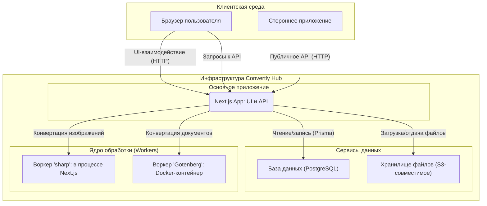

# 🏗️ Архитектура приложения "Convertly Hub"

Этот документ описывает высокоуровневую архитектуру SaaS-платформы "Convertly Hub", разработанную на основе [технического задания](./tech_saas.md). Архитектура спроектирована с учетом принципов масштабируемости, отказоустойчивости и удобства развертывания.

> **Статус на 24 августа 2026.** В репозитории реализованы и протестированы frontend-прототип, Prisma-схема, `GET /api/health`, серверный S3-сервис, NextAuth.js, парольная регистрация/вход, RBAC, Telegram linking и Core-конвертация. `POST /api/v1/convert` создаёт задание, Core обрабатывает `JPG ↔ PNG` через `sharp` и `DOCX → PDF` через Gotenberg, а в БД фиксируются статусы и метаданные результата. Выдача или хранение бинарного результата остаётся этапом privacy. Dashboard доступен `USER` и `ADMIN`, а `/management` защищён серверной проверкой `ADMIN`. UI данных кабинета пока использует mock-данные.

---

## 1. Общая концепция

Система построена на базе фреймворка **Next.js** и следует **трехслойной модели** с четким разделением ответственности (Separation of Concerns).

1.  **Клиентский слой (Frontend):** Пользовательский интерфейс, созданный с помощью React и Tailwind CSS. Отвечает за визуализацию, взаимодействие с пользователем и отображение данных. Рендерится преимущественно на сервере (SSR/RSC) благодаря Next.js.
2.  **Серверный слой (Backend/API):** Бизнес-логика, реализованная на базе API-маршрутов Next.js. Этот слой управляет аутентификацией, доступом к данным, валидацией и выступает в роли оркестратора, координируя работу с базой данных и ядром обработки.
3.  **Ядро обработки (Core/Workers):** Изолированная среда для выполнения ресурсоемких задач по конвертации файлов. Этот слой вынесен за пределы основного серверного процесса, чтобы избежать блокировки Event Loop.

### Схема взаимодействия компонентов



---

## 2. Локальная среда разработки (Docker)

Для обеспечения консистентности и простоты настройки локального окружения используется **Docker Compose**. Файл `docker-compose.yml` определяет и запускает все необходимые сервисы.

```yaml
services:
  db:
    image: postgres:15-alpine
    # ... (база данных PostgreSQL)

  minio:
    image: minio/minio
    # ... (S3-совместимое хранилище)

  gotenberg:
    image: gotenberg/gotenberg:8
    # ... (воркер для конвертации документов)
```

- **`db` (PostgreSQL):** База данных для хранения информации о пользователях, файлах и истории операций.
- **`minio` (MinIO):** S3-совместимое хранилище для загружаемых файлов. Предоставляет веб-интерфейс для удобного просмотра.
- **`gotenberg`:** Воркер для выполнения "тяжелых" конвертаций (например, DOCX в PDF).

Основное **Next.js приложение** запускается **локально на хост-машине** (через `npm run dev`) и подключается к этим сервисам через `localhost` и соответствующие порты, указанные в `docker-compose.yml`.

На 22 августа 2026 локальный Compose-стек проверен запуском: PostgreSQL, MinIO и Gotenberg доступны на опубликованных портах. Серверный модуль `lib/storage/s3.ts` работает с MinIO через S3 API; пользовательские потоки конвертации и API ещё не подключены к нему.

---

## 3. Структура папок проекта

Проект использует рекомендованную структуру Next.js (App Router), дополненную папками для разделения бизнес-логики.

```plaintext
/
├── 📂 app/                  # Основная папка Next.js App Router
│   ├── 📂 (auth)/           # Группа маршрутов для аутентификации
│   │   ├── 📂 login/
│   │   │   └── page.tsx     # Страница входа
│   │   ├── 📂 register/
│   │   │   └── page.tsx     # Страница регистрации
│   │   └── 📂 password-reset/
│   │       ├── page.tsx     # Страница запроса на сброс пароля
│   │       └── 📂 [token]/
│   │           └── page.tsx # Страница установки нового пароля
│   ├── 📂 (dashboard)/      # Группа маршрутов личного кабинета (защищена NextAuth-сессией)
│   │   ├── 📂 dashboard/
│   │   │   └── page.tsx     # Страница личного кабинета
│   │   ├── 📂 management/
│   │   │   └── page.tsx     # Страница панели администратора
│   │   └── layout.tsx       # Макет для личного кабинета
│   ├── 📂 api/
│   │   ├── 📂 auth/
│   │   │   ├── 📂 [...nextauth]/ # Обработчики NextAuth.js
│   │   │   └── 📂 register/      # Регистрация пользователя
│   │   ├── 📂 health/       # Проверка состояния инфраструктуры
│   │   └── 📂 v1/convert/   # Приём авторизованных запросов на конвертацию
│   ├── 📂 pricing/          # Маршрут для страницы с тарифами
│   │   └── page.tsx         # Страница с тарифами
│   ├── 📂 docs/            # Маршрут для страницы с документацией API
│   │   └── page.tsx         # Страница с документацией API
│   ├── layout.tsx           # Корневой макет
│   ├── page.tsx             # Главная страница
│   └── not-found.tsx        # Страница 404
│
├── 📂 components/           # Переиспользуемые React-компоненты (UI)
│   ├── 📂 auth/             # Компоненты, связанные с аутентификацией
│   │   ├── LoginForm.tsx    # Форма входа
│   │   ├── RegisterForm.tsx # Форма регистрации
│   │   └── 📂 __tests__/    # Component-тесты форм
│   ├── 📂 core/             # Ключевые компоненты (Header, Footer, FileDropzone, модальные окна)
│   │   ├── ConfirmationModal.tsx # Модальное окно подтверждения (например, для удаления)
│   │   ├── Header.tsx       # Основной компонент заголовка с навигацией и ссылками аутентификации, недавно рефакторингованный для улучшения UX
│   │   ├── Footer.tsx
│   │   └── FileDropzone.tsx
│   │   └── 📂 __tests__/    # Тесты загрузки файлов
│   ├── 📂 dashboard/        # Компоненты для личного кабинета
│   │   ├── UserProfile.tsx
│   │   ├── UserPlan.tsx
│   │   ├── ApiKeyManager.tsx
│   │   ├── PrivacySettings.tsx
│   │   └── ConversionHistory.tsx # История конвертаций с поиском, сортировкой и пагинацией
│   │   └── 📂 __tests__/    # Тесты настроек кабинета
│   ├── 📂 admin/            # Компоненты для панели администратора
│   │   ├── EditUserModal.tsx    # Модальное окно для редактирования пользователя
│   │   ├── SystemMonitoring.tsx
│   │   └── UserManagement.tsx # Управление пользователями с редактированием, удалением, сортировкой и пагинацией
│   │   └── 📂 __tests__/    # Тесты управления пользователями
│   ├── 📂 pricing/          # Компоненты для страницы с тарифами
│   │   └── PaymentModal.tsx   # Модальное окно для оплаты
│   │   └── 📂 __tests__/      # Тесты платежного UI
│   └── 📂 ui/               # Базовые, переиспользуемые UI-компоненты
│       ├── Button.tsx       # Универсальная кнопка с вариантами
│       ├── Card.tsx         # Компонент карточки
│       ├── Input.tsx        # Поле ввода
│       ├── Label.tsx        # Метка для поля ввода
│       ├── Modal.tsx        # Генерируемое модальное окно
│       ├── Pagination.tsx   # Компонент пагинации
│       ├── Search.tsx       # Компонент поиска с debounce
│       └── Toast.tsx        # Компонент для уведомлений (toasts)
│       └── 📂 __tests__/    # Тесты базовых UI-компонентов
│
├── 📂 components/**/__tests__/# Тесты размещены рядом с соответствующими компонентами
│
├── 📂 e2e/                  # Критические пользовательские сценарии Playwright
├── playwright.config.ts      # Конфигурация E2E-тестов и локального web-сервера
│
├── 📂 docs/                 # Техническая и эксплуатационная документация
│   ├── START.md             # Актуальная инструкция запуска
│   └── 📂 archive/          # Исторические черновики документации
│
├── 📂 lib/                  # Вспомогательные модули
│   ├── 📂 api/              # Проверка API-ключа и создание задач конвертации
│   ├── 📂 auth/             # Конфигурация NextAuth.js и серверное чтение сессии
│   ├── 📂 core/             # Конвертация файлов и фоновая обработка заданий
│   ├── 📂 hooks/            # React-хуки (например, use-toast)
│   └── 📂 storage/          # Серверный S3-сервис и его unit-тесты
│
├── 📂 prisma/               # Файлы Prisma ORM (схема, миграции)
│
├── 📂 public/               # Статические файлы (изображения, иконки)
│
├── 📂 .codex/               # Локальные правила и skills для Codex
│   ├── 📂 rules/local-database.md   # Правила работы с PostgreSQL и Prisma
│   └── 📂 skills/                   # Локальные skills Codex
│       ├── database-reviewer/       # Ревью PostgreSQL и Prisma
│       ├── database-migrations/     # Безопасные миграции
│       ├── postgres-patterns/       # SQL и производительность PostgreSQL
│       └── prisma-patterns/         # Схема и Prisma Client
│
├── .env                     # Приватные переменные окружения (ключи, доступы)
├── .prettierrc              # Конфигурация Prettier
├── .prettierignore          # Файлы, игнорируемые Prettier
├── docker-compose.yml       # Конфигурация локальной среды
├── eslint.config.mjs        # Конфигурация ESLint
├── tailwind.config.ts       # Конфигурация Tailwind CSS
├── postcss.config.mjs       # Конфигурация PostCSS
├── next.config.ts           # Конфигурация Next.js
└── package.json             # Зависимости и скрипты
```

---

## 4. UI-библиотеки

Для построения интерфейса используются следующие библиотеки:

- **`tailwind-css`**: Утилитарный CSS-фреймворк для быстрой и кастомной стилизации.
- **`lucide-react`**: Легковесная и современная библиотека иконок.
- **`sonner`**: Библиотека для создания элегантных toast-уведомлений.
- **`class-variance-authority` (`cva`)**: Помогает создавать типизированные и переиспользуемые варианты UI-компонентов с Tailwind CSS.
- **`clsx` и `tailwind-merge`**: Утилиты для условного и безопасного объединения CSS-классов.
- **`@radix-ui/react-slot`**: Позволяет создавать композитные компоненты, передавая свойства дочерним элементам (используется в `Button.tsx` для пропа `asChild`).

- **Frontend ↔ Backend:** сессии ведёт **NextAuth.js** через JWT в HttpOnly cookie. `POST /api/auth/register` валидирует входные данные и создаёт пользователя с bcrypt-хешем пароля. Credentials Provider проверяет пароль, статус пользователя и записывает `lastLoginAt`; затем форма входа создаёт сессию и перенаправляет в кабинет. `AuthSessionProvider` предоставляет клиенту статус сессии. Dashboard доступен всем авторизованным пользователям, а server-side layout `/management` допускает только `ADMIN`.

- **Telegram linking:** авторизованный пользователь получает одноразовый deep link через `POST /api/account/telegram/link`. В базе хранится только SHA-256-хеш токена и его срок жизни. Telegram webhook проверяет секретный HTTP-заголовок, принимает только команду `/start link_<token>`, однократно привязывает идентификатор чата и удаляет токен.

- **Backend ↔ База данных:** `GET /api/health` использует Prisma и PostgreSQL для проверки доступности. `POST /api/v1/convert` находит активный неотозванный API-ключ по SHA-256-хешу, создаёт `ConversionLog` со статусом `PENDING` и обновляет `lastUsedAt` ключа в одной транзакции. Фоновый обработчик последовательно переводит задание в `PROCESSING`, затем в `COMPLETED` или `FAILED`; внешнее обращение к Gotenberg выполняется вне транзакции.

- **Модель данных (миграции применены локально):** Prisma-схема и миграции описывают пользователей, API-ключи и журналы конвертаций, включая роли, статус блокировки, тариф, настройку хранения, S3-метаданные и жизненный цикл ключа. Маршрут приёма конвертаций использует `ApiKey` и `ConversionLog`; генерация и отзыв API-ключей будут реализованы отдельным этапом.

- **Backend ↔ Хранилище S3 (сервис реализован):** `lib/storage/s3.ts` инкапсулирует проверку бакета, загрузку, скачивание и удаление объектов через AWS SDK v3. Клиент использует приватные переменные окружения, path-style для MinIO и не создаёт публичных URL. API-маршруты будут вызывать сервис после аутентификации и валидации файлов.

- **Backend ↔ Ядро:**
  - Легкие задачи: `JPG ↔ PNG` выполняются библиотекой `sharp` в серверном процессе.
  - Тяжелые задачи: `DOCX → PDF` отправляются с таймаутом 30 секунд на маршрут Gotenberg `/forms/libreoffice/convert`.
  - Перед обработкой Core сверяет сигнатуру JPG/PNG/DOCX с заявленным MIME; для ответа Gotenberg проверяется PDF-сигнатура. Неудача фиксируется общим безопасным сообщением без деталей воркера.
  - `PDF → DOCX` остаётся planned: PDF не содержит полной исходной структуры DOCX, поэтому это направление не реализуется через Gotenberg и потребует отдельного best-effort-конвертера и контроля качества результата.

- **Политика загрузки файлов:** UI и API используют единый набор исходных типов (`JPG`, `PNG`, `DOCX`, `PDF`) и лимит одного файла 10 МБ. Клиентская проверка нужна для быстрой обратной связи, серверная — обязательна; Core дополнительно проверяет сигнатуру файла перед обработкой.

---

## 5. API endpoints

Все API-маршруты реализованы как Route Handlers Next.js. В ответах не раскрываются пароли, API-ключи и значения переменных окружения.

| Метод и путь | Авторизация | Назначение | Основные успешные ответы |
| --- | --- | --- | --- |
| `GET /api/health` | Не требуется | Проверяет доступность PostgreSQL и Gotenberg для локального мониторинга. | `200` — инфраструктура доступна; `500` — один или несколько сервисов недоступны. |
| `GET`, `POST /api/auth/[...nextauth]` | NextAuth.js | Служебные маршруты NextAuth.js: чтение сессии и Credentials-вход через HttpOnly cookie. | Формат и статусы определяются NextAuth.js. |
| `POST /api/auth/register` | Не требуется | Регистрирует пользователя: проверяет данные и сохраняет bcrypt-хеш пароля. | `201` — пользователь создан; `400` — некорректные данные; `409` — email занят. |
| `POST /api/account/telegram/link` | Сессия NextAuth.js | Создаёт одноразовую ссылку для привязки Telegram к текущему пользователю. | `200` — deep link и срок действия; `401` — нет сессии; `503` — Telegram не настроен. |
| `POST /api/telegram/webhook` | Заголовок `x-telegram-bot-api-secret-token` | Принимает обновление Telegram и подтверждает одноразовую привязку по команде `/start link_<token>`. | `200` — обновление обработано или безопасно проигнорировано; `401` — неверный секрет; `400` — некорректный JSON. |
| `POST /api/v1/convert` | `Authorization: Bearer <API_KEY>` | Принимает метаданные допустимого файла в `multipart/form-data`, проверяет API-ключ и создаёт очередь `PENDING`. | `202` — задача создана; `401`, `413`, `415`, `422` — ошибка доступа или валидации. |

Маршрут `/api/v1/convert` пока не выполняет конвертацию и не выдаёт файл: это будет подключено на этапе Core. Управление жизненным циклом API-ключей также реализуется отдельной задачей.

---

## 6. Развертывание (Deployment)

Архитектура позволяет гибко подходить к развертыванию.

- **Основное приложение (Next.js):** Разворачивается на платформах вроде **Vercel**, Netlify или в Docker-контейнере на собственном сервере.
- **База данных (PostgreSQL):** В продакшене используется управляемый сервис (`Managed Database`), такой как **Supabase**, **Neon** или **AWS RDS**. Это заменяет локальный Docker-сервис `db`.
- **Хранилище файлов (S3):** Используется облачный сервис, например, **Cloudflare R2** или **AWS S3**. Это заменяет локальный Docker-сервис `minio`.
- **Воркер (Gotenberg):** Разворачивается как отдельный **Docker-контейнер** на любой платформе, поддерживающей их (например, AWS Fargate, Google Cloud Run, или на том же сервере, что и Next.js-приложение).

Такое разделение позволяет масштабировать каждый компонент независимо. Например, при высокой нагрузке можно увеличить количество контейнеров `Gotenberg`, не затрагивая основное приложение.

---

## 7. Потоки аутентификации (целевое состояние)

Для реализации после server-side аутентификации предусмотрены следующие механизмы. Страницы и UI-состояния уже есть, но токены, отправка сообщений и изменение пароля ещё не подключены.

- **Восстановление пароля:**
  1. Пользователь вводит свой email на странице `/password-reset`.
  2. Система генерирует уникальный токен, сохраняет его в базе данных и отправляет пользователю на почту ссылку для сброса пароля.
  3. Пользователь переходит по ссылке на страницу `/password-reset/[token]`, где может установить новый пароль.
- **Подтверждение почты и Telegram:**
  1. При регистрации или изменении `email` / `telegramId` генерируется токен подтверждения.
  2. Пользователю отправляется ссылка (на почту или в Telegram) для верификации.
  3. После перехода по ссылке, аккаунт помечается как подтвержденный в базе данных.

---

## 8. Тестирование frontend

Тестовая инфраструктура построена на Jest с `next/jest`, TypeScript-поддержкой через `ts-jest` и окружением `jsdom`. Component-тесты используют React Testing Library и `@testing-library/user-event`, проверяя наблюдаемое пользователем поведение. Для изолированных сетевых integration-тестов подключён MSW.

- `npm test` запускает все тесты.
- `npm run test:coverage` формирует отчёт покрытия.
- `npm run test:e2e` запускает критические пользовательские сценарии Playwright в Chromium.
- Тесты располагаются рядом с компонентами в каталогах `__tests__`: `auth`, `core`, `dashboard`, `admin`, `pricing` и `ui`. Они покрывают загрузку файлов, аутентификацию, модальные окна, платежный сценарий, Dashboard и управление пользователями.
