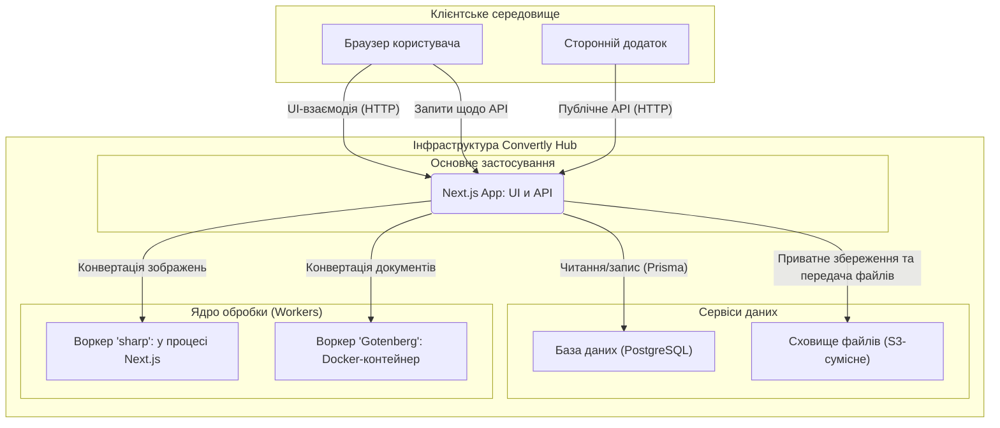
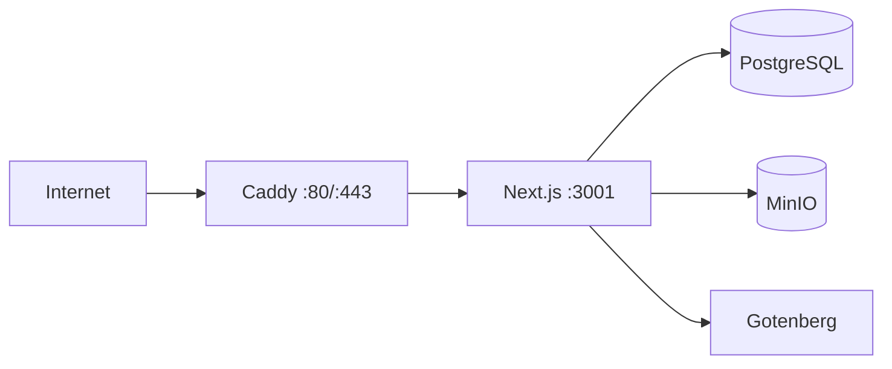

# 🏗️ Архітектура застосунку «Convertly Hub»

Цей документ описує високорівневу архітектуру SaaS-платформи «Convertly Hub», розроблену на основі [технічного завдання](./tech_saas.md). Архітектуру спроєктовано з урахуванням принципів масштабованості, відмовостійкості та зручності розгортання.

Для послідовного вивчення реалізації використовуйте [посібники за шарами](./guides/README.md): вони показують конкретні frontend, backend/server, database і testing/operations файли, а не замінюють цей високорівневий документ.

> **Статус на 8 вересня 2026.** У репозиторії реалізовано й протестовано Prisma-схему, `GET /api/health`, серверний S3-сервіс, NextAuth.js, парольну реєстрацію/вхід, відновлення пароля та email-підтвердження через SMTP, RBAC, Telegram linking, Core-конвертацію, приватність результатів, життєвий цикл API-ключів, тарифні квоти, account deletion workflow і server-side API адмінпанелі. `JPG ↔ PNG` обробляється через `sharp`, `DOCX → PDF` — через Gotenberg. Головна сторінка доступна для обмеженої гостьової конвертації та для browser-конвертації після входу. Dashboard доступний `USER` і `ADMIN`, а `/management` захищено серверною перевіркою `ADMIN`. Реальний backend integration/E2E-набір запускається на окремому Compose-стеку. Публічне demo використовує Northflank + Supabase; переносиму конфігурацію та порядок перенесення описано у [cloud-portability.md](./cloud-portability.md).

---

## 1. Загальна концепція

Систему побудовано на базі фреймворку **Next.js**; вона дотримується **тришарової моделі** з чітким розподілом відповідальності (Separation of Concerns).

1.  **Клієнтський шар (Frontend):** Користувацький інтерфейс, створений за допомогою React і Tailwind CSS. Відповідає за візуалізацію, взаємодію з користувачем і відображення даних. Рендериться переважно на сервері (SSR/RSC) завдяки Next.js.
2.  **Серверний шар (Backend/API):** Бізнес-логіка, реалізована на базі API-маршрутів Next.js. Цей шар керує автентифікацією, доступом до даних, валідацією та виступає в ролі оркестратора, координуючи роботу з базою даних і ядром обробки.
3.  **Ядро обробки (Core/Workers):** Ізольоване середовище для виконання ресурсомістких завдань конвертації файлів. Цей шар винесено за межі основного серверного процесу, щоб уникнути блокування Event Loop.

### Схема взаємодії компонентів



---

## 2. Локальне середовище розробки (Docker)

Для забезпечення послідовності та простоти налаштування локального середовища використовується **Docker Compose**. Файл `docker-compose.yml` визначає й запускає всі необхідні сервіси.

```yaml
services:
  db:
    image: postgres:15-alpine
    # ... (база даних PostgreSQL)

  minio:
    image: minio/minio
    # ... (S3-совместимое хранилище)

  gotenberg:
    image: gotenberg/gotenberg:8
    # ... (воркер для конвертації документів)

  mailhog:
    image: mailhog/mailhog:v1.0.1
    # ... (локальний SMTP та inbox для auth-листів)
```

- **`db` (PostgreSQL):** База даних для зберігання інформації про користувачів, файли та історію операцій.
- **`minio` (MinIO):** S3-сумісне сховище для завантажуваних файлів. Надає вебінтерфейс для зручного перегляду.
- **`gotenberg`:** Воркер для виконання «важких» конвертацій (наприклад, DOCX у PDF).
- **`mailhog`:** Локальна SMTP-пісочниця та inbox для перевірки листів відновлення пароля й підтвердження email.

Основний **Next.js застосунок** запускається **локально на хост-машині** (через `npm run dev`) і підключається до цих сервісів через `localhost` і відповідні порти, вказані у `docker-compose.yml`.

Станом на 25 серпня 2026 локальний Compose-стек перевірено запуском: PostgreSQL, MinIO і Gotenberg доступні на опублікованих портах. `lib/storage/s3.ts` працює з MinIO через S3 API; його використовують API-ключова та session-захищена конвертація, коли результат має зберігатися.

---

## 3. Структура папок проєкту

Проєкт використовує рекомендовану структуру Next.js (App Router), доповнену папками для розділення бізнес-логіки.

```plaintext
/
├── app/                              # Next.js App Router
│   ├── (auth)/                       # /login, /register, /password-reset[/token]
│   ├── (dashboard)/                  # Захищені /dashboard і /management
│   │   ├── layout.tsx                # Перевірка сесії Dashboard
│   │   └── management/layout.tsx     # Дополнительная server-side перевірка ADMIN
│   ├── api/
│   │   ├── account/                  # Сесія: profile, password/email, billing, preferences, Telegram, ключі, конвертація/завантаження
│   │   ├── admin/                    # Только ADMIN: users, metrics, API-ключі і account deletion requests
│   │   ├── auth/                     # NextAuth, реєстрація, reset и email verification
│   │   ├── guest/                    # Потокова конвертація для гостей та cookie-квота
│   │   ├── telegram/webhook/          # Webhook прив'язки Telegram
│   │   ├── v1/                       # Public API: конвертація та завантаження за API-ключем
│   │   └── health/                   # Стан PostgreSQL, S3 и Gotenberg
│   ├── docs/, pricing/               # Публічні сторінки API-документації та тарифів
│   ├── layout.tsx, page.tsx          # Корневой layout и browser-конвертация
│   ├── robots.ts                     # File-based metadata route для /robots.txt
│   └── not-found.tsx, globals.css
├── components/
│   ├── auth/                         # AuthSessionProvider, auth-форми та PasswordField
│   ├── core/                         # Header, Footer, FileDropzone, guest summary и confirmation UI
│   ├── dashboard/                    # Профіль, тариф, ключи, privacy, Telegram, історія
│   ├── admin/                        # UserManagement, SystemMonitoring, AccountDeletionRequests, EditUserModal
│   ├── pricing/                      # PaymentModal для Mock Checkout
│   ├── ui/                           # Базові Button, Card, Input, Search, CursorPagination, Modal, Toast тощо
│   └── **/__tests__/                 # Component-тести поруч із компонентами
├── lib/
│   ├── account-deletion/             # Request/cancel/process workflow, S3 cleanup и audit events
│   ├── admin/                        # Пошук користувачів, metrics та адміністративні дії
│   ├── api/                          # API-ключи, request-конвертации, rate limit
│   ├── auth/                         # NextAuth, пользователи, server-side authorization
│   ├── billing/                      # Плани, квоти та Mock Checkout
│   ├── client/                       # Тимчасовий кеш guest-результатів у браузері
│   ├── core/                         # Валідація сигнатур, sharp/Gotenberg та життєвий цикл job
│   ├── files/                        # Єдина політика upload MIME/размеров
│   ├── guest/                        # Guest cookie-квота та локальний IP limiter
│   ├── mail/                         # SMTP-відправлення reset/verification-листів
│   ├── privacy/, storage/            # Правила зберігання та S3/MinIO-клієнт
│   ├── telegram/                     # Одноразові Telegram link-токени та webhook-логіка
│   ├── hooks/                        # Клієнтські UI-хуки
│   └── prisma.ts                     # Prisma Client через PostgreSQL adapter
├── prisma/
│   ├── schema.prisma                 # Моделі та перерахування
│   └── migrations/                   # Відстежувані SQL-міграції
├── scripts/                          # API/subscription audit, one-off admin/plan scripts и integration/E2E runner
├── e2e/                              # Browser critical flows і real backend integration/E2E spec
├── playwright.config.ts              # Конфігурація критичних browser E2E на порту 3001
├── playwright.integration.config.ts  # Ізольовані backend integration/E2E на порту 3101
├── docs/                             # Architecture, guides, local/cloud runbooks, audits, backlog и журнал
├── public/                           # Статичні файли
├── types/next-auth.d.ts              # Розширення типів user і JWT-сессии NextAuth
├── .codex/, AGENTS.md, CODEX.md      # Локальні правила та project skills для Codex
├── deploy/Caddyfile                  # HTTPS reverse proxy для Oracle production-стека
├── .env, .env.example                # Локальні секрети та безпечний шаблон без секретів
├── .env.production.example            # Окремий безпечний шаблон production-секретів
├── .dockerignore, Dockerfile          # ARM64-compatible standalone-сборка Next.js
├── jest.config.ts, jest.setup.ts      # Jest roots и test environment
├── next.config.ts, prisma.config.ts   # Next standalone output и Prisma 7 configuration
├── docker-compose.yml                # PostgreSQL, MinIO, Gotenberg и MailHog
├── docker-compose.integration.yml    # Одноразовий ізольований стек для реальних тестів
├── docker-compose.production.yml     # Oracle A1: private services, app и Caddy
└── package.json                      # Команди та залежності
```

---

## 4. UI-бібліотеки

Для побудови інтерфейсу використовуються такі бібліотеки:

- **`tailwind-css`**: Утилітарний CSS-фреймворк для швидкої та кастомної стилізації.
- **`lucide-react`**: Легковагова й сучасна бібліотека іконок.
- **`sonner`**: Бібліотека для створення елегантних toast-сповіщень.
- **`class-variance-authority` (`cva`)**: Допомагає створювати типізовані й повторно використовувані варіанти UI-компонентів із Tailwind CSS.
- **`clsx` і `tailwind-merge`**: Утиліти для умовного та безпечного об’єднання CSS-класів.
- **`@radix-ui/react-slot`**: Дає змогу створювати композитні компоненти, передаючи властивості дочірнім елементам (використовується в `Button.tsx` для пропа `asChild`).

- **Frontend ↔ Backend:** сесіями керує **NextAuth.js** через JWT у HttpOnly cookie. `POST /api/auth/register` валідує вхідні дані та створює користувача з bcrypt-хешем пароля. Credentials Provider перевіряє пароль, статус користувача й записує `lastLoginAt`; потім форма входу створює сесію та перенаправляє в кабінет. `AuthSessionProvider` надає клієнту статус сесії. Dashboard доступний усім авторизованим користувачам, а server-side layout `/management` допускає лише `ADMIN`. Головна сторінка для неавторизованих показує вхід/реєстрацію; після входу вона надсилає файл до session-захищеного `POST /api/account/conversions`, не розкриваючи й не вимагаючи API-ключ.

- **Telegram linking і recovery:** авторизований користувач отримує одноразовий deep link через `POST /api/account/telegram/link`. У базі зберігається SHA-256-хеш link-токена та його строк життя; нове pending-посилання не скасовує вже підтверджену прив’язку. Webhook перевіряє секретний HTTP-заголовок і приймає команди лише з private chat: `/start` і `/help` надають безпечну інструкцію, `/start link_<token>` одноразово прив’язує chat ID і нормалізований public username, а довільне повідомлення отримує нейтральну відповідь. `DELETE /api/account/telegram/link` owner-scoped очищує Telegram і незавершений link token. `POST /api/auth/password-reset/request` приймає email або `@username`, завжди відповідає нейтрально та надсилає reset URL Bot API лише в уже підтверджений активний chat. Username не є доказом володіння.

- **Backend ↔ База даних:** session-захищені маршрути API-ключів створюють криптографічно стійкий секрет, зберігають лише SHA-256-хеш і безпечний префікс, а відкликання виконують через owner-scoped атомарне оновлення. Секрет повертається лише у відповіді створення та позначається `Cache-Control: no-store`. `POST /api/v1/convert` знаходить активний невідкликаний API-ключ за SHA-256-хешем, обмежує його 30 запитами за хвилину в поточному процесі та створює `ConversionLog` зі статусом `PENDING`. Розмір, MIME і цільовий формат перевіряються до читання файла в пам’ять, потім Core звіряє сигнатуру. Фоновий обробник послідовно переводить завдання в `PROCESSING`, потім у `COMPLETED` або `FAILED`; зовнішнє звернення до Gotenberg виконується поза транзакцією.

- **Адміністрування:** маршрути `/api/admin/*` додатково перевіряють актуальні `role=ADMIN` і `status=ACTIVE` у PostgreSQL, а не лише дані JWT-сесії. Список користувачів використовує cursor-pagination і обмежений `select`; статуси оновлюються атомарно, а відкликання API-ключа не зачіпає журнал конвертацій. Для пошуку підрядком за ім’ям/email у великій таблиці потрібен окремий індекс `pg_trgm` після перевірки `EXPLAIN`.

- **Модель даних (міграції застосовано локально):** Prisma-схема та міграції описують користувачів, API-ключі й журнали конвертацій, зокрема ролі, статус блокування, тариф, налаштування зберігання, S3-метадані та життєвий цикл ключа. `ApiKey.keyHash` унікальний, а індекс `(userId, revokedAt)` підтримує видачу й відкликання власних активних ключів.

- **Backend ↔ Сховище S3:** `lib/storage/s3.ts` інкапсулює перевірку бакета, завантаження, скачування та видалення об’єктів через AWS SDK v3. За `storeConversions=true` готовий файл кладеться за user-scoped ключем; публічні URL не створюються. `GET /api/v1/conversions/:conversionId/download` спершу перевіряє API-ключ і належність результату користувачеві, потім передає об’єкт потоком. За `storeConversions=false` S3 не викликається, а `POST /api/v1/convert` повертає файл напряму з `Cache-Control: no-store`.

- **Тарифи та Mock Checkout:** `lib/billing/plans.ts` задає ліміти конвертацій, розмір файла, storage, retention, API і підтримку. `Subscription` відокремлює активний тариф від однієї замінюваної заявки `PENDING_DEMO`; demo-форма не приймає і не зберігає реквізити та не надає платні права. Free зберігає результат 24 години, а API Keys і File Storage залишаються недоступними. Usage береться з PostgreSQL, а `expiresAt` виводиться в історії та блокує прострочене скачування.

- **Backend ↔ Ядро:**
  - Легкі завдання: `JPG ↔ PNG` виконуються бібліотекою `sharp` у серверному процесі.
  - Важкі завдання: `DOCX → PDF` надсилаються з таймаутом 30 секунд на маршрут Gotenberg `/forms/libreoffice/convert`.
  - Перед обробкою Core звіряє сигнатуру JPG/PNG/DOCX із заявленим MIME; для відповіді Gotenberg перевіряється PDF-сигнатура. Невдача фіксується спільним безпечним повідомленням без деталей воркера.
  - `PDF → DOCX` залишається planned: PDF не містить повної вихідної структури DOCX, тому цей напрям не реалізується через Gotenberg і потребуватиме окремого best-effort-конвертера та контролю якості результату.

- **Політика завантаження файлів:** UI й API використовують єдиний набір вихідних типів (`JPG`, `PNG`, `DOCX`, `PDF`) і ліміт одного файла 10 МБ. Клієнтська перевірка потрібна для швидкого зворотного зв’язку, серверна — обов’язкова; Core додатково перевіряє сигнатуру файла перед обробкою.

---

## 5. API endpoints

Усі API-маршрути реалізовані як Route Handlers Next.js. У відповідях не розкриваються паролі, API-ключі та значення змінних середовища.

| Метод і шлях                                          | Авторизація                                 | Призначення                                                                                                                                                                                                                                                                                                                                         | Основні успішні відповіді                                                                                                                                                                                                                                                     |
| ----------------------------------------------------- | ------------------------------------------- | --------------------------------------------------------------------------------------------------------------------------------------------------------------------------------------------------------------------------------------------------------------------------------------------------------------------------------------------------- | ----------------------------------------------------------------------------------------------------------------------------------------------------------------------------------------------------------------------------------------------------------------------------- |
| `GET /api/health`                                     | Не потрібна                                 | Перевіряє доступність PostgreSQL, налаштованого S3-бакета та Gotenberg. Не містить лічильників, помилок або конфігурації.                                                                                                                                                                                                                            | `200` і `{ status: "healthy", database: "up", storage: "up", gotenberg: "up" }` — усі core-сервіси доступні; `503` і `status: "degraded"` — один або кілька недоступні, поле кожного сервісу лишається `up`/`down`.                                                          |
| `GET`, `POST /api/auth/[...nextauth]`                 | NextAuth.js                                 | Службові маршрути NextAuth.js: читання сесії та Credentials-вхід через HttpOnly cookie.                                                                                                                                                                                                                                                              | Формат і статуси визначаються NextAuth.js.                                                                                                                                                                                                                                     |
| `POST /api/auth/register`                             | Не потрібна                                 | Реєструє користувача: перевіряє дані та зберігає bcrypt-хеш пароля.                                                                                                                                                                                                                                                                                   | `201` — користувача створено; `400` — некоректні дані; `409` — email зайнято.                                                                                                                                                                                                   |
| `GET`, `POST /api/guest/conversions`                  | Не потрібна                                 | `GET` повертає фактичний залишок гостьової місячної квоти та дату скидання за HttpOnly cookie; `POST` виконує потокову `JPG ↔ PNG`/`DOCX → PDF` до 1 МБ. S3 і серверна історія не використовуються.                                                                                                                                                    | `GET 200` — `{ remainingImage, remainingDocument, resetsAt }`; `POST 200` — файл; `413`, `415`, `422` — валідація; `429` — квота або короткий IP limiter.                                                                                                                      |
| `GET`, `PATCH /api/account/profile`                   | Активна сесія NextAuth.js                   | Читає профіль поточного користувача й безпечно змінює лише відображуване ім’я.                                                                                                                                                                                                                                                                       | `200` — профіль; `400` — неправильне ім’я; `401` — немає активної сесії.                                                                                                                                                                                                       |
| `POST /api/account/email`                             | Активна сесія NextAuth.js                   | Починає зміну email після перевірки поточного пароля; попередній email зберігається до підтвердження нового.                                                                                                                                                                                                                                         | `202` — посилання надіслано; `400` — неправильний пароль/введення; `409` — адреса зайнята.                                                                                                                                                                                      |
| `POST /api/account/password`                          | Активна сесія NextAuth.js                   | Змінює пароль після перевірки поточного та збігу нового пароля з підтвердженням.                                                                                                                                                                                                                                                                      | `200` — пароль змінено; `400` — неправильне введення/поточний пароль.                                                                                                                                                                                                          |
| `GET`, `POST /api/account/billing`                    | Активна сесія NextAuth.js                   | Віддає active plan/usage та зберігає одну Mock Checkout-заявку.                                                                                                                                                                                                                                                                                      | `200` — billing або заявка; `400` — некоректна demo-форма; `401` — немає сесії.                                                                                                                                                                                                 |
| `PATCH /api/account/preferences`                      | Активна сесія NextAuth.js                   | Змінює `storeConversions` для тарифу з налаштовуваним зберіганням.                                                                                                                                                                                                                                                                                   | `200` — налаштування оновлено; `403` — Free; `401` — немає сесії.                                                                                                                                                                                                               |
| `GET`, `POST /api/account/conversions`                | Активна сесія NextAuth.js                   | `GET` повертає лише історію поточного календарного billing-місяця cursor-сторінками по 10 рядків (`cursor` — останній id попередньої сторінки). `POST` приймає browser-завантаження та перед створенням нового завдання порівнює SHA-256 вихідного вмісту й target format із неістеклими приватно збереженими результатами цього ж користувача. | `GET 200` — `{ conversions, nextCursor }`; `POST 202` — збережене завдання прийнято; `POST 200` — потік результату за вимкненого зберігання або `{ status: "AVAILABLE", conversionId }`; `401`, `413`, `415`, `422`, `429` — безпечна помилка доступу, валідації або ліміту. |
| `GET /api/account/conversions/:conversionId/download` | Активна сесія NextAuth.js                   | Віддає збережений результат лише власникові через HttpOnly-сесію; доки завдання виконується, повертає `409` для безпечного polling.                                                                                                                                                                                                                  | `200` — бінарний потік; `401` — немає активної сесії; `404` — результат недоступний; `409` — обробку не завершено.                                                                                                                                                             |
| `POST`, `DELETE /api/account/telegram/link`           | Сесія NextAuth.js                           | `POST` створює одноразове посилання для прив’язки Telegram до поточного користувача; `DELETE` owner-scoped відв’язує Telegram та інвалідує pending link.                                                                                                                                                                                              | `POST 200` — deep link і строк дії; `DELETE 200` — відв’язано; `401` — немає активної сесії; `503` — Telegram не налаштовано.                                                                                                                                                 |
| `POST /api/telegram/webhook`                          | Заголовок `x-telegram-bot-api-secret-token` | Приймає private-chat оновлення Telegram і підтверджує одноразову прив’язку за командою `/start link_<token>`; усі інші updates безпечно ігноруються.                                                                                                                                                                                                 | `200` — оновлення оброблено або безпечно проігноровано; `401` — неправильний секрет; `400` — некоректний JSON.                                                                                                                                                                |
| `POST /api/auth/password-reset/request`               | Публічний                                   | Нейтрально приймає email або `@telegram_username`; одноразове посилання надсилається через SMTP або лише до підтвердженого Telegram chat.                                                                                                                                                                                                            | `202` — однакова відповідь для наявного й відсутнього контакту; `400` — невалідний контакт.                                                                                                                                                                                   |
| `POST /api/auth/password-reset/confirm`               | Публічний токен                             | Встановлює пароль за неістеклим одноразовим токеном.                                                                                                                                                                                                                                                                                                 | `200` — пароль змінено; `400` — невалідні дані або токен.                                                                                                                                                                                                                      |
| `POST /api/account/email-verification`                | Сесія NextAuth.js                           | Надсилає поточному користувачеві нове одноразове email-посилання.                                                                                                                                                                                                                                                                                    | `202` — лист прийнято до доставки; `401` — немає сесії; `503` — SMTP недоступний.                                                                                                                                                                                              |
| `POST /api/auth/email-verification/confirm`           | Публічний токен                             | Підтверджує email за неістеклим одноразовим токеном.                                                                                                                                                                                                                                                                                                 | `200` — email підтверджено; `400` — невалідний/істеклий токен.                                                                                                                                                                                                                 |
| `GET /api/account/api-keys`                           | Сесія NextAuth.js                           | Повертає метадані API-ключів поточного активного користувача, без хешів і секретів.                                                                                                                                                                                                                                                                 | `200` — список; `401` — немає активної сесії.                                                                                                                                                                                                                                  |
| `POST /api/account/api-keys`                          | Сесія NextAuth.js                           | Створює API-ключ поточного активного користувача. Вихідний секрет присутній лише в цій відповіді.                                                                                                                                                                                                                                                    | `201` — ключ і секрет; `400` — некоректне ім’я; `401` — немає активної сесії.                                                                                                                                                                                                  |
| `DELETE /api/account/api-keys/:apiKeyId`              | Сесія NextAuth.js                           | Відкликає власний активний ключ без видалення історії конвертацій.                                                                                                                                                                                                                                                                                   | `204` — відкликано; `401` — немає активної сесії; `404` — ключ недоступний користувачеві.                                                                                                                                                                                      |
| `GET /api/admin/users`                                | Активна сесія `ADMIN`                       | Шукає користувачів за `query` в імені/email; підтримує сортування `sort` (`createdAt`, `email`, `role`, `plan`, `status`, `lastLoginAt`) і `direction` (`asc`/`desc`), cursor-pagination (`limit` 1–50, `cursor`).                                                                                                                                 | `200` — `{ users, nextCursor, total }`; `401` — немає прав.                                                                                                                                                                                                                   |
| `GET /api/admin/metrics`                              | Активна сесія `ADMIN`                       | Повертає фактичні агрегати за 30 днів і read-only статуси PostgreSQL, S3 та Gotenberg.                                                                                                                                                                                                                                                              | `200` — метрики; `401` — немає прав; `503` — моніторинг недоступний.                                                                                                                                                                                                          |
| `PATCH /api/admin/users/:userId/status`               | Активна сесія `ADMIN`                       | Встановлює користувачеві `ACTIVE` або `SUSPENDED`; власний статус змінювати не можна.                                                                                                                                                                                                                                                               | `204` — оновлено; `400` — неправильне тіло; `403` — власний статус; `404` — користувача не знайдено.                                                                                                                                                                          |
| `DELETE /api/admin/api-keys/:apiKeyId`                | Активна сесія `ADMIN`                       | Відкликає будь-який активний API-ключ без видалення конвертацій.                                                                                                                                                                                                                                                                                     | `204` — відкликано; `401` — немає прав; `404` — ключ недоступний.                                                                                                                                                                                                             |
| `POST /api/v1/convert`                                | `Authorization: Bearer <API_KEY>`           | Конвертує допустимий файл із `multipart/form-data`; ліміт — 30 запитів за хвилину на ключ. За `storeConversions=true` ставить завдання в чергу та зберігає результат приватно; за `false` повертає файл потоком без зберігання.                                                                                                                      | `202` — завдання прийнято для зберігання; `200` — потік результату без зберігання; `401`, `413`, `415`, `422` — помилка доступу або валідації; `429` і `Retry-After` — ліміт перевищено.                                                                                       |
| `GET /api/v1/conversions/:conversionId/download`      | `Authorization: Bearer <API_KEY>`           | Скачує збережений результат лише власникові API-ключа; публічного S3-посилання не видає.                                                                                                                                                                                                                                                            | `200` — бінарний потік; `401` — немає ключа; `404` — немає доступного збереженого результату; `503` — сховище недоступне.                                                                                                                                                      |

`GET /api/account/conversions` приймає server-side параметри `search`, `sort`, `direction` і `cursor`. Пошук обмежено ім’ям вихідного файла, а сортування дозволено лише для імені файла, цільового формату, статусу, строку доступності та дати створення; загальний `total` дає Dashboard змогу показати `Page X of Y` для поточного billing-місяця.

Коли з’явиться список конвертацій в Admin Panel, він не має копіювати `ConversionHistory`. Спершу буде додано окремий `ADMIN` API-контракт із масовим вибором і безпечним видаленням. Нейтральні `Search` і `CursorPagination` уже спільні для Dashboard та Admin; типи рядків, checkbox-вибір, підтвердження видалення й адмінські права залишаться в окремому admin-container.

Маршрут `/api/v1/convert` уже виконує доступні Core-конвертації, а життєвий цикл API-ключів реалізовано session-захищеними маршрутами Dashboard.

Лімітер MVP зберігає вікно запитів у пам’яті процесу. До запуску кількох інстансів Next.js його необхідно замінити спільним Redis-сумісним сховищем, щоб ліміт зберігався між екземплярами та перезапусками.

---

## 6. Розгортання (Deployment)

Для першого production MVP обрано окремий ARM64 instance Oracle Cloud Free Tier
`VM.Standard.A1.Flex` у Frankfurt. `docker-compose.production.yml` не використовує
локальний compose-файл: він збирає Next.js як standalone-образ і запускає Caddy,
PostgreSQL, MinIO та Gotenberg на одній VM. Caddy — єдиний сервіс із відкритими
портами `80/443`; інші контейнери доступні лише всередині Docker-мережі.



- **Next.js:** `output: 'standalone'`; production-образ будується на цільовій A1 VM,
  щоб Prisma, `sharp` і `bcrypt` отримали ARM64 runtime.
- **PostgreSQL і MinIO:** persistent Docker volumes, без опублікованих портів і
  без публічних S3 URL.
- **Gotenberg:** внутрішній Docker-контейнер для `DOCX → PDF`; на A1 до go-live
  обов’язково виконується реальний smoke-test конвертації.
- **Пошта:** MailHog — лише локально. Production використовує SMTP скриньки
  `support@bon.kharkov.ua` через змінні `.env.production`.
- **Операції:** міграції Prisma та призначення першого адміністратора запускаються
  вручну одноразовим `migrate` service. Backup PostgreSQL і дзеркалювання MinIO
  мають надходити до зовнішнього сховища: дані на тій самій VM не є backup.

Точний порядок створення VM, ARM64 preflight, DNS/HTTPS, firewall, секрети, перший
запуск, оновлення та smoke-tests зафіксовано в
[oracle-production-deployment.md](./oracle-production-deployment.md).

Oracle A1 залишається бажаним single-server варіантом. Альтернативні
плани не змінюють цей контур і не є готовою конфігурацією: Vercel Pro
потребує managed PostgreSQL/S3 і закритого conversion worker, а Render Paid —
окремих Web і private Gotenberg services. Обмежений Render Free + MailHog
допустимий лише як неповне developer demo, не public production. Їхні умови,
межі та майбутній порядок дій описано в
[vercel-production-deployment.md](./vercel-production-deployment.md) и
[render-production-deployment.md](./render-production-deployment.md).

Для тимчасового функціонального demo підготовлено окремий контур Northflank
Developer Sandbox + Supabase Free: public Next.js і private Gotenberg — дві
Northflank services, а
PostgreSQL/S3-compatible Storage — один Supabase project. Он не заменяет
production і не об’єднує Gotenberg з MinIO. Точний порядок, GitHub monorepo
build context, secrets, міграції та обмеження описано в
[northflank-supabase-demo.md](./northflank-supabase-demo.md).

---

## 7. Потоки автентифікації

- **Відновлення пароля:**
  1. Користувач вводить email або `@username` на `/password-reset`; `POST /api/auth/password-reset/request` завжди відповідає нейтрально й не розкриває існування облікового запису.
  2. Для наявного користувача зберігається лише SHA-256-хеш одноразового токена на 30 хвилин; посилання доставляється через SMTP (локально — MailHog) або Bot API до підтвердженого Telegram chat. Локальний limiter допускає три запити на contact за годину.
  3. `/password-reset/[token]` викликає `POST /api/auth/password-reset/confirm`; новий bcrypt-хеш зберігається, а токен видаляється.
- **Підтвердження пошти та Telegram:**
  1. Після успішної реєстрації сервер автоматично створює й надсилає email-посилання; якщо локальний SMTP тимчасово недоступний, акаунт залишається створеним, а Dashboard дає змогу безпечно запросити нове посилання через `POST /api/account/email-verification`. Хеш токена та TTL 30 хвилин зберігаються в `User`.
  2. `/email-verification/[token]` підтверджує токен через `POST /api/auth/email-verification/confirm`, встановлює `emailVerified` і видаляє токен. Під час зміни адреси старий email залишається активним, а `pendingEmail` замінює його лише після підтвердження посилання, доставленого на нову адресу.
  3. Telegram використовує незалежну одноразову webhook-прив’язку (`POST /api/account/telegram/link` і `POST /api/telegram/webhook`).

## 8. Потік видалення акаунта

Видалення не виконується безпосередньо натисканням кнопки Dashboard. Користувач створює
автентифікований request, а остаточне видалення підтверджує `ADMIN`:

```text
Dashboard → POST /api/account/deletion-request → PENDING + audit event
Admin Panel → claim PROCESSING → private S3 cleanup → delete User → COMPLETED
                                      └─ помилка → FAILED, доступний controlled retry
```

Поки request `PENDING`, користувач може скасувати його. Система не дозволяє
створити другий активний request. Перед видаленням `User` backend видаляє
користувацькі S3-об’єкти; Prisma каскадно видаляє пов’язані account records.
Сам `AccountDeletionRequest` і його append-only events зберігаються як audit
історія з nullable `userId` і snapshot email. Support mailbox отримує best-effort
сповіщення про request, скасування, success і failure; помилка надсилання листа не
скасовує коректно завершену операцію даних. Повний runbook, статуси та
перевірки — у [account-deletion-workflow.md](./account-deletion-workflow.md).

---

## 9. Тестування

Тестову інфраструктуру побудовано на Jest із `next/jest`, TypeScript-підтримкою через `ts-jest` і середовищем `jsdom`. Component-тести використовують React Testing Library та `@testing-library/user-event`, перевіряючи видиму користувачеві поведінку. Для ізольованих мережевих integration-тестів підключено MSW.

- `npm test` запускає всі тести.
- `npm run test:coverage` формує звіт покриття.
- `npm run test:e2e` запускає критичні користувацькі сценарії Playwright у Chromium.
- `npm run test:integration` піднімає ізольовані PostgreSQL, MinIO, Gotenberg і MailHog, запускає Next.js на `127.0.0.1:3101` і виконує реальний backend integration/E2E-сценарій. Звичайний `.env` і локальний Compose-стек при цьому не використовуються.
- Тести розташовано поруч із компонентами в каталогах `__tests__`: `auth`, `core`, `dashboard`, `admin`, `pricing` і `ui`. Вони покривають завантаження файлів, автентифікацію, модальні вікна, платіжний сценарій, Dashboard і керування користувачами.

GitHub Actions на кожному push у гілку, що зачіпає `convertly-hub`, виконує lint, type-check, production build, Jest, browser Playwright і окрему job `Real backend integration/E2E`. У разі падіння Playwright артефакти потрапляють до `test-results/`: локально каталог ігнорується Git, а в CI додається до запуску разом із логами integration-сервісів.
