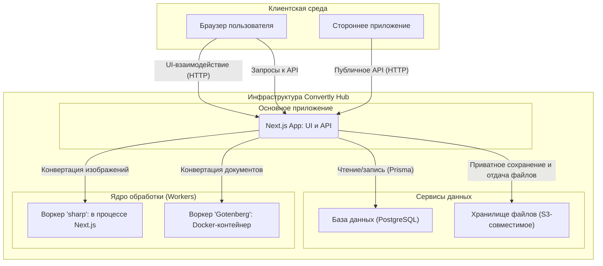
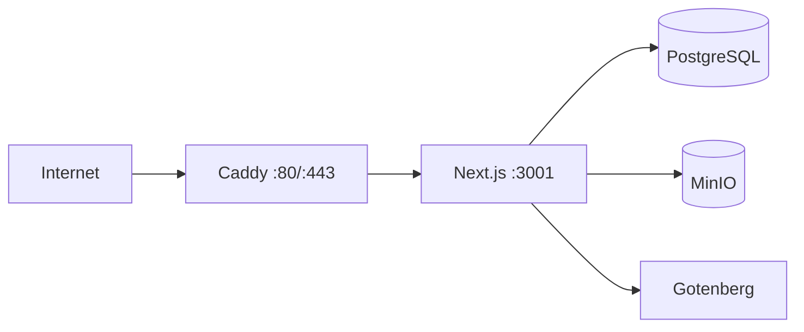

# 🏗️ Архитектура приложения "Convertly Hub"

Этот документ описывает высокоуровневую архитектуру SaaS-платформы "Convertly Hub", разработанную на основе [технического задания](./tech_saas.md). Архитектура спроектирована с учетом принципов масштабируемости, отказоустойчивости и удобства развертывания.

Для последовательного изучения реализации используйте [руководства по слоям](./guides/README.md): они показывают конкретные frontend, backend/server, database и testing/operations файлы, а не заменяют этот высокоуровневый документ.

> **Статус на 1 сентября 2026.** В репозитории реализованы и протестированы Prisma-схема, `GET /api/health`, серверный S3-сервис, NextAuth.js, парольная регистрация/вход, восстановление пароля и email-подтверждение через SMTP/MailHog, RBAC, Telegram linking, Core-конвертация, приватность результатов, жизненный цикл API-ключей, тарифные квоты и Mock Checkout, а также server-side API админ-панели. `JPG ↔ PNG` обрабатывается через `sharp`, `DOCX → PDF` — через Gotenberg. Главная страница доступна для ограниченной гостевой конвертации и для browser-конвертации после входа: `GET /api/guest/conversions` гидратирует остаток месячной cookie-квоты, а `POST` не сохраняет файлы; `POST /api/account/conversions` использует HttpOnly-сессию, не принимает API-ключ и скачивает готовый результат через session-защищённый маршрут. При включённом хранении результат также помещается в приватный S3; при выключенном — возвращается бинарным потоком без записи в S3. Dashboard доступен `USER` и `ADMIN`, а `/management` защищён серверной проверкой `ADMIN`. Реальный backend integration/E2E-набор запускается на отдельном Compose-стеке и проверяет HTTP-контракты PostgreSQL, MinIO, Gotenberg, авторизации, квот, API-ключей и администрирования.

---

## 1. Общая концепция

Система построена на базе фреймворка **Next.js** и следует **трехслойной модели** с четким разделением ответственности (Separation of Concerns).

1.  **Клиентский слой (Frontend):** Пользовательский интерфейс, созданный с помощью React и Tailwind CSS. Отвечает за визуализацию, взаимодействие с пользователем и отображение данных. Рендерится преимущественно на сервере (SSR/RSC) благодаря Next.js.
2.  **Серверный слой (Backend/API):** Бизнес-логика, реализованная на базе API-маршрутов Next.js. Этот слой управляет аутентификацией, доступом к данным, валидацией и выступает в роли оркестратора, координируя работу с базой данных и ядром обработки.
3.  **Ядро обработки (Core/Workers):** Изолированная среда для выполнения ресурсоемких задач по конвертации файлов. Этот слой вынесен за пределы основного серверного процесса, чтобы избежать блокировки Event Loop.

### Схема взаимодействия компонентов



---

## 2. Локальная среда разработки (Docker)

Для обеспечения консистентности и простоты настройки локального окружения используется **Docker Compose**. Файл `docker-compose.yml` определяет и запускает все необходимые сервисы.

```yaml
services:
  db:
    image: postgres:15-alpine
    # ... (база данных PostgreSQL)

  minio:
    image: minio/minio
    # ... (S3-совместимое хранилище)

  gotenberg:
    image: gotenberg/gotenberg:8
    # ... (воркер для конвертации документов)

  mailhog:
    image: mailhog/mailhog:v1.0.1
    # ... (локальный SMTP и inbox для auth-писем)
```

- **`db` (PostgreSQL):** База данных для хранения информации о пользователях, файлах и истории операций.
- **`minio` (MinIO):** S3-совместимое хранилище для загружаемых файлов. Предоставляет веб-интерфейс для удобного просмотра.
- **`gotenberg`:** Воркер для выполнения "тяжелых" конвертаций (например, DOCX в PDF).
- **`mailhog`:** Локальная SMTP-песочница и inbox для проверки писем восстановления пароля и подтверждения email.

Основное **Next.js приложение** запускается **локально на хост-машине** (через `npm run dev`) и подключается к этим сервисам через `localhost` и соответствующие порты, указанные в `docker-compose.yml`.

На 25 августа 2026 локальный Compose-стек проверен запуском: PostgreSQL, MinIO и Gotenberg доступны на опубликованных портах. `lib/storage/s3.ts` работает с MinIO через S3 API; его используют API-ключевая и session-защищённая конвертация, когда результат должен храниться.

---

## 3. Структура папок проекта

Проект использует рекомендованную структуру Next.js (App Router), дополненную папками для разделения бизнес-логики.

```plaintext
/
├── app/                              # Next.js App Router
│   ├── (auth)/                       # /login, /register, /password-reset[/token]
│   ├── (dashboard)/                  # Защищённые /dashboard и /management
│   │   ├── layout.tsx                # Проверка сессии Dashboard
│   │   └── management/layout.tsx     # Дополнительная server-side проверка ADMIN
│   ├── api/
│   │   ├── account/                  # Сессия: profile, password/email, billing, preferences, Telegram, ключи, конвертации/скачивание
│   │   ├── admin/                    # Только ADMIN: пользователи и API-ключи
│   │   ├── auth/                     # NextAuth, регистрация, reset и email verification
│   │   ├── guest/                    # Потоковая гостевая конвертация и cookie-квота
│   │   ├── telegram/webhook/          # Webhook привязки Telegram
│   │   ├── v1/                       # Public API: конвертация и скачивание по API-ключу
│   │   └── health/                   # Состояние PostgreSQL, S3 и Gotenberg
│   ├── docs/, pricing/               # Публичные страницы API-документации и тарифов
│   ├── layout.tsx, page.tsx          # Корневой layout и browser-конвертация
│   ├── robots.ts                     # File-based metadata route для /robots.txt
│   └── not-found.tsx, globals.css
├── components/
│   ├── auth/                         # SessionProvider, формы auth и PasswordField
│   ├── core/                         # Header, Footer, FileDropzone, guest summary и confirmation UI
│   ├── dashboard/                    # Профиль, тариф, ключи, privacy, Telegram, история
│   ├── admin/                        # UserManagement, SystemMonitoring, EditUserModal
│   ├── pricing/                      # PaymentModal для Mock Checkout
│   ├── ui/                           # Базовые Button, Card, Input, Search, CursorPagination, Modal, Toast и др.
│   └── **/__tests__/                 # Component-тесты рядом с компонентами
├── lib/
│   ├── admin/                        # Поиск пользователей и административные действия
│   ├── api/                          # API-ключи, request-конвертации, rate limit
│   ├── auth/                         # NextAuth, пользователи, server-side authorization
│   ├── billing/                      # Планы, квоты и Mock Checkout
│   ├── client/                       # Временный кэш guest-результатов в браузере
│   ├── core/                         # Валидация сигнатур, sharp/Gotenberg и жизненный цикл job
│   ├── files/                        # Единая политика upload MIME/размеров
│   ├── guest/                        # Guest cookie-квота и локальный IP limiter
│   ├── mail/                         # SMTP-отправка reset/verification-писем
│   ├── privacy/, storage/            # Правила хранения и S3/MinIO-клиент
│   ├── telegram/                     # Одноразовые Telegram link-токены и webhook-логика
│   ├── hooks/                        # Клиентские UI-хуки
│   └── prisma.ts                     # Prisma Client через PostgreSQL adapter
├── prisma/
│   ├── schema.prisma                 # Модели и перечисления
│   └── migrations/                   # Отслеживаемые SQL-миграции
├── scripts/                          # API audit, первый администратор и integration/E2E runner
├── e2e/                              # Browser critical flows и real backend integration/E2E spec
├── playwright.config.ts              # Конфигурация критических browser E2E на порту 3001
├── playwright.integration.config.ts  # Изолированные backend integration/E2E на порту 3101
├── docs/                             # Architecture, local-start, START, DB schema, audits, планы и журнал
├── public/                           # Статические файлы
├── types/next-auth.d.ts              # Расширение типов user и JWT-сессии NextAuth
├── .codex/, AGENTS.md, CODEX.md      # Локальные правила и project skills для Codex
├── deploy/Caddyfile                  # HTTPS reverse proxy для Oracle production-стека
├── .env, .env.example                # Локальные секреты и безопасный шаблон без секретов
├── .env.production.example            # Отдельный безопасный шаблон production-секретов
├── .dockerignore, Dockerfile          # ARM64-compatible standalone-сборка Next.js
├── docker-compose.yml                # PostgreSQL, MinIO, Gotenberg и MailHog
├── docker-compose.integration.yml    # Одноразовый изолированный стек для реальных тестов
├── docker-compose.production.yml     # Oracle A1: private services, app и Caddy
└── package.json                      # Команды и зависимости
```

---

## 4. UI-библиотеки

Для построения интерфейса используются следующие библиотеки:

- **`tailwind-css`**: Утилитарный CSS-фреймворк для быстрой и кастомной стилизации.
- **`lucide-react`**: Легковесная и современная библиотека иконок.
- **`sonner`**: Библиотека для создания элегантных toast-уведомлений.
- **`class-variance-authority` (`cva`)**: Помогает создавать типизированные и переиспользуемые варианты UI-компонентов с Tailwind CSS.
- **`clsx` и `tailwind-merge`**: Утилиты для условного и безопасного объединения CSS-классов.
- **`@radix-ui/react-slot`**: Позволяет создавать композитные компоненты, передавая свойства дочерним элементам (используется в `Button.tsx` для пропа `asChild`).

- **Frontend ↔ Backend:** сессии ведёт **NextAuth.js** через JWT в HttpOnly cookie. `POST /api/auth/register` валидирует входные данные и создаёт пользователя с bcrypt-хешем пароля. Credentials Provider проверяет пароль, статус пользователя и записывает `lastLoginAt`; затем форма входа создаёт сессию и перенаправляет в кабинет. `AuthSessionProvider` предоставляет клиенту статус сессии. Dashboard доступен всем авторизованным пользователям, а server-side layout `/management` допускает только `ADMIN`. Главная страница для неавторизованных показывает вход/регистрацию; после входа она отправляет файл в session-защищённый `POST /api/account/conversions`, не раскрывая и не требуя API-ключ.

- **Telegram linking:** авторизованный пользователь получает одноразовый deep link через `POST /api/account/telegram/link`. В базе хранится только SHA-256-хеш токена и его срок жизни. Telegram webhook проверяет секретный HTTP-заголовок, принимает только команду `/start link_<token>`, однократно привязывает идентификатор чата и удаляет токен.

- **Backend ↔ База данных:** session-защищённые маршруты API-ключей создают криптографически стойкий секрет, сохраняют только SHA-256-хеш и безопасный префикс, а отзыв выполняют через owner-scoped атомарное обновление. Секрет возвращается только в ответе создания и помечается `Cache-Control: no-store`. `POST /api/v1/convert` находит активный неотозванный API-ключ по SHA-256-хешу, ограничивает его 30 запросами в минуту в текущем процессе и создаёт `ConversionLog` со статусом `PENDING`. Размер, MIME и целевой формат проверяются до чтения файла в память, затем Core сверяет сигнатуру. Фоновый обработчик последовательно переводит задание в `PROCESSING`, затем в `COMPLETED` или `FAILED`; внешнее обращение к Gotenberg выполняется вне транзакции.

- **Администрирование:** маршруты `/api/admin/*` дополнительно проверяют актуальные `role=ADMIN` и `status=ACTIVE` в PostgreSQL, а не только данные JWT-сессии. Список пользователей использует cursor-pagination и ограниченный `select`; статусы обновляются атомарно, а отзыв API-ключа не затрагивает журнал конвертаций. Для поиска подстрокой по имени/email на большой таблице нужен отдельный `pg_trgm` индекс после проверки `EXPLAIN`.

- **Модель данных (миграции применены локально):** Prisma-схема и миграции описывают пользователей, API-ключи и журналы конвертаций, включая роли, статус блокировки, тариф, настройку хранения, S3-метаданные и жизненный цикл ключа. `ApiKey.keyHash` уникален, а индекс `(userId, revokedAt)` поддерживает выдачу и отзыв собственных активных ключей.

- **Backend ↔ Хранилище S3:** `lib/storage/s3.ts` инкапсулирует проверку бакета, загрузку, скачивание и удаление объектов через AWS SDK v3. При `storeConversions=true` готовый файл кладётся по user-scoped ключу; публичные URL не создаются. `GET /api/v1/conversions/:conversionId/download` сначала проверяет API-ключ и принадлежность результата пользователю, затем передаёт объект потоком. При `storeConversions=false` S3 не вызывается, а `POST /api/v1/convert` возвращает файл напрямую с `Cache-Control: no-store`.

- **Тарифы и Mock Checkout:** `lib/billing/plans.ts` задаёт лимиты конвертаций, размер файла, storage, retention, API и поддержку. `Subscription` отделяет активный тариф от одной заменяемой заявки `PENDING_DEMO`; demo-форма не принимает и не хранит реквизиты и не выдаёт платные права. Free хранит результат 24 часа, а API Keys и File Storage остаются недоступными. Usage берётся из PostgreSQL, а `expiresAt` выводится в истории и блокирует просроченное скачивание.

- **Backend ↔ Ядро:**
  - Легкие задачи: `JPG ↔ PNG` выполняются библиотекой `sharp` в серверном процессе.
  - Тяжелые задачи: `DOCX → PDF` отправляются с таймаутом 30 секунд на маршрут Gotenberg `/forms/libreoffice/convert`.
  - Перед обработкой Core сверяет сигнатуру JPG/PNG/DOCX с заявленным MIME; для ответа Gotenberg проверяется PDF-сигнатура. Неудача фиксируется общим безопасным сообщением без деталей воркера.
  - `PDF → DOCX` остаётся planned: PDF не содержит полной исходной структуры DOCX, поэтому это направление не реализуется через Gotenberg и потребует отдельного best-effort-конвертера и контроля качества результата.

- **Политика загрузки файлов:** UI и API используют единый набор исходных типов (`JPG`, `PNG`, `DOCX`, `PDF`) и лимит одного файла 10 МБ. Клиентская проверка нужна для быстрой обратной связи, серверная — обязательна; Core дополнительно проверяет сигнатуру файла перед обработкой.

---

## 5. API endpoints

Все API-маршруты реализованы как Route Handlers Next.js. В ответах не раскрываются пароли, API-ключи и значения переменных окружения.

| Метод и путь                                          | Авторизация                                 | Назначение                                                                                                                                                                                                                                                                                                                                          | Основные успешные ответы                                                                                                                                                                                                                                                      |
| ----------------------------------------------------- | ------------------------------------------- | --------------------------------------------------------------------------------------------------------------------------------------------------------------------------------------------------------------------------------------------------------------------------------------------------------------------------------------------------- | ----------------------------------------------------------------------------------------------------------------------------------------------------------------------------------------------------------------------------------------------------------------------------- |
| `GET /api/health`                                     | Не требуется                                | Проверяет доступность PostgreSQL, настроенного S3-бакета и Gotenberg. Не содержит счётчиков, ошибок или конфигурации.                                                                                                                                                                                                                               | `200` и `{ status: "healthy", database: "up", storage: "up", gotenberg: "up" }` — все core-сервисы доступны; `503` и `status: "degraded"` — один или несколько недоступны, поле каждого сервиса остаётся `up`/`down`.                                                         |
| `GET`, `POST /api/auth/[...nextauth]`                 | NextAuth.js                                 | Служебные маршруты NextAuth.js: чтение сессии и Credentials-вход через HttpOnly cookie.                                                                                                                                                                                                                                                             | Формат и статусы определяются NextAuth.js.                                                                                                                                                                                                                                    |
| `POST /api/auth/register`                             | Не требуется                                | Регистрирует пользователя: проверяет данные и сохраняет bcrypt-хеш пароля.                                                                                                                                                                                                                                                                          | `201` — пользователь создан; `400` — некорректные данные; `409` — email занят.                                                                                                                                                                                                |
| `GET`, `POST /api/guest/conversions`                  | Не требуется                                | `GET` возвращает фактический остаток гостевой месячной квоты и дату сброса по HttpOnly cookie; `POST` выполняет потоковую `JPG ↔ PNG`/`DOCX → PDF` до 1 МБ. S3 и серверная история не используются.                                                                                                                                                 | `GET 200` — `{ remainingImage, remainingDocument, resetsAt }`; `POST 200` — файл; `413`, `415`, `422` — валидация; `429` — квота или короткий IP limiter.                                                                                                                     |
| `GET`, `PATCH /api/account/profile`                   | Активная сессия NextAuth.js                 | Читает профиль текущего пользователя и безопасно изменяет только отображаемое имя.                                                                                                                                                                                                                                                                  | `200` — профиль; `400` — неверное имя; `401` — нет активной сессии.                                                                                                                                                                                                           |
| `POST /api/account/email`                             | Активная сессия NextAuth.js                 | Начинает смену email после проверки текущего пароля; прежний email сохраняется до подтверждения нового.                                                                                                                                                                                                                                             | `202` — ссылка отправлена; `400` — неверный пароль/ввод; `409` — адрес занят.                                                                                                                                                                                                 |
| `POST /api/account/password`                          | Активная сессия NextAuth.js                 | Меняет пароль после проверки текущего и совпадения нового пароля с подтверждением.                                                                                                                                                                                                                                                                  | `200` — пароль изменён; `400` — неверный ввод/текущий пароль.                                                                                                                                                                                                                 |
| `GET`, `POST /api/account/billing`                    | Активная сессия NextAuth.js                 | Отдаёт active plan/usage и сохраняет одну Mock Checkout-заявку.                                                                                                                                                                                                                                                                                     | `200` — billing или заявка; `400` — некорректная demo-форма; `401` — нет сессии.                                                                                                                                                                                              |
| `PATCH /api/account/preferences`                      | Активная сессия NextAuth.js                 | Меняет `storeConversions` для тарифа с настраиваемым хранением.                                                                                                                                                                                                                                                                                     | `200` — настройка обновлена; `403` — Free; `401` — нет сессии.                                                                                                                                                                                                                |
| `GET`, `POST /api/account/conversions`                | Активная сессия NextAuth.js                 | `GET` возвращает только историю текущего календарного billing-месяца cursor-страницами по 10 строк (`cursor` — последний id предыдущей страницы). `POST` принимает browser-загрузку и перед созданием новой задачи сравнивает SHA-256 исходного содержимого и target format с неистёкшими приватно сохранёнными результатами этого же пользователя. | `GET 200` — `{ conversions, nextCursor }`; `POST 202` — сохранённая задача принята; `POST 200` — поток результата при выключенном хранении либо `{ status: "AVAILABLE", conversionId }`; `401`, `413`, `415`, `422`, `429` — безопасная ошибка доступа, валидации или лимита. |
| `GET /api/account/conversions/:conversionId/download` | Активная сессия NextAuth.js                 | Отдаёт сохранённый результат только владельцу через HttpOnly-сессию; пока задача выполняется, возвращает `409` для безопасного polling.                                                                                                                                                                                                             | `200` — бинарный поток; `401` — нет активной сессии; `404` — результат недоступен; `409` — обработка не завершена.                                                                                                                                                            |
| `POST /api/account/telegram/link`                     | Сессия NextAuth.js                          | Создаёт одноразовую ссылку для привязки Telegram к текущему пользователю.                                                                                                                                                                                                                                                                           | `200` — deep link и срок действия; `401` — нет сессии; `503` — Telegram не настроен.                                                                                                                                                                                          |
| `POST /api/telegram/webhook`                          | Заголовок `x-telegram-bot-api-secret-token` | Принимает обновление Telegram и подтверждает одноразовую привязку по команде `/start link_<token>`.                                                                                                                                                                                                                                                 | `200` — обновление обработано или безопасно проигнорировано; `401` — неверный секрет; `400` — некорректный JSON.                                                                                                                                                              |
| `POST /api/auth/password-reset/request`               | Публичный                                   | Нейтрально принимает email и при наличии аккаунта отправляет одноразовую ссылку.                                                                                                                                                                                                                                                                    | `202` — одинаковый ответ для существующего и отсутствующего email; `400` — невалидный email.                                                                                                                                                                                  |
| `POST /api/auth/password-reset/confirm`               | Публичный токен                             | Устанавливает пароль по неистёкшему одноразовому токену.                                                                                                                                                                                                                                                                                            | `200` — пароль изменён; `400` — невалидные данные либо токен.                                                                                                                                                                                                                 |
| `POST /api/account/email-verification`                | Сессия NextAuth.js                          | Отправляет текущему пользователю новую одноразовую email-ссылку.                                                                                                                                                                                                                                                                                    | `202` — письмо принято к доставке; `401` — нет сессии; `503` — SMTP недоступен.                                                                                                                                                                                               |
| `POST /api/auth/email-verification/confirm`           | Публичный токен                             | Подтверждает email по неистёкшему одноразовому токену.                                                                                                                                                                                                                                                                                              | `200` — email подтверждён; `400` — невалидный/истёкший токен.                                                                                                                                                                                                                 |
| `GET /api/account/api-keys`                           | Сессия NextAuth.js                          | Возвращает метаданные API-ключей текущего активного пользователя, без хешей и секретов.                                                                                                                                                                                                                                                             | `200` — список; `401` — нет активной сессии.                                                                                                                                                                                                                                  |
| `POST /api/account/api-keys`                          | Сессия NextAuth.js                          | Создаёт API-ключ текущего активного пользователя. Исходный секрет присутствует только в этом ответе.                                                                                                                                                                                                                                                | `201` — ключ и секрет; `400` — некорректное имя; `401` — нет активной сессии.                                                                                                                                                                                                 |
| `DELETE /api/account/api-keys/:apiKeyId`              | Сессия NextAuth.js                          | Отзывает собственный активный ключ без удаления истории конвертаций.                                                                                                                                                                                                                                                                                | `204` — отозван; `401` — нет активной сессии; `404` — ключ недоступен пользователю.                                                                                                                                                                                           |
| `GET /api/admin/users`                                | Активная сессия `ADMIN`                     | Ищет пользователей по `query` в имени/email; поддерживает сортировку `sort` (`createdAt`, `email`, `role`, `plan`, `status`, `lastLoginAt`) и `direction` (`asc`/`desc`), cursor-pagination (`limit` 1–50, `cursor`).                                                                                                                               | `200` — `{ users, nextCursor, total }`; `401` — нет прав.                                                                                                                                                                                                                     |
| `GET /api/admin/metrics`                              | Активная сессия `ADMIN`                     | Возвращает фактические агрегаты за 30 дней и read-only статусы PostgreSQL, S3 и Gotenberg.                                                                                                                                                                                                                                                          | `200` — метрики; `401` — нет прав; `503` — мониторинг недоступен.                                                                                                                                                                                                             |
| `PATCH /api/admin/users/:userId/status`               | Активная сессия `ADMIN`                     | Устанавливает пользователю `ACTIVE` или `SUSPENDED`; собственный статус менять нельзя.                                                                                                                                                                                                                                                              | `204` — обновлено; `400` — неверное тело; `403` — собственный статус; `404` — пользователь не найден.                                                                                                                                                                         |
| `DELETE /api/admin/api-keys/:apiKeyId`                | Активная сессия `ADMIN`                     | Отзывает любой активный API-ключ без удаления конвертаций.                                                                                                                                                                                                                                                                                          | `204` — отозван; `401` — нет прав; `404` — ключ недоступен.                                                                                                                                                                                                                   |
| `POST /api/v1/convert`                                | `Authorization: Bearer <API_KEY>`           | Конвертирует допустимый файл из `multipart/form-data`; лимит — 30 запросов в минуту на ключ. При `storeConversions=true` ставит задачу в очередь и сохраняет результат приватно; при `false` возвращает файл потоком без сохранения.                                                                                                                | `202` — задача принята для сохранения; `200` — поток результата без хранения; `401`, `413`, `415`, `422` — ошибка доступа или валидации; `429` и `Retry-After` — превышен лимит.                                                                                              |
| `GET /api/v1/conversions/:conversionId/download`      | `Authorization: Bearer <API_KEY>`           | Скачивает сохранённый результат только владельцу API-ключа; публичной S3-ссылки не выдаёт.                                                                                                                                                                                                                                                          | `200` — бинарный поток; `401` — нет ключа; `404` — нет доступного сохранённого результата; `503` — хранилище недоступно.                                                                                                                                                      |

`GET /api/account/conversions` принимает server-side параметры `search`, `sort`, `direction` и `cursor`. Поиск ограничен именем исходного файла, а сортировка разрешена только для имени файла, целевого формата, статуса, срока доступности и даты создания; общий `total` позволяет Dashboard показать `Page X of Y` для текущего billing-месяца.

Когда появится список конвертаций в Admin Panel, он не должен копировать `ConversionHistory`. Сначала будет добавлен отдельный `ADMIN` API-контракт с массовым выбором и безопасным удалением. Нейтральные `Search` и `CursorPagination` уже общие для Dashboard и Admin; типы строк, checkbox-выбор, подтверждение удаления и админские права останутся в отдельном admin-container.

Маршрут `/api/v1/convert` уже выполняет доступные Core-конвертации, а жизненный цикл API-ключей реализован session-защищёнными маршрутами Dashboard.

Лимитер MVP хранит окно запросов в памяти процесса. До запуска нескольких инстансов Next.js его необходимо заменить общим Redis-совместимым хранилищем, чтобы лимит сохранялся между экземплярами и перезапусками.

---

## 6. Развертывание (Deployment)

Для первого production MVP выбран отдельный ARM64 instance Oracle Cloud Free Tier
`VM.Standard.A1.Flex` в Frankfurt. `docker-compose.production.yml` не использует
локальный compose-файл: он собирает Next.js как standalone-образ и запускает Caddy,
PostgreSQL, MinIO и Gotenberg на одной VM. Caddy — единственный сервис с открытыми
портами `80/443`; остальные контейнеры доступны только внутри Docker-сети.



- **Next.js:** `output: 'standalone'`; production-образ строится на целевой A1 VM,
  чтобы Prisma, `sharp` и `bcrypt` получили ARM64 runtime.
- **PostgreSQL и MinIO:** persistent Docker volumes, без опубликованных портов и
  без публичных S3 URL.
- **Gotenberg:** внутренний Docker-контейнер для `DOCX → PDF`; на A1 до go-live
  обязательно выполняется реальный smoke-test конвертации.
- **Почта:** MailHog — только локально. Production использует SMTP ящика
  `support@bon.kharkov.ua` через переменные `.env.production`.
- **Операции:** миграции Prisma и назначение первого администратора запускаются
  вручную одноразовым `migrate` service. Backup PostgreSQL и зеркалирование MinIO
  должны уходить во внешнее хранилище: данные на той же VM не являются backup.

Точный порядок создания VM, ARM64 preflight, DNS/HTTPS, firewall, секреты, первый
запуск, обновление и smoke-tests зафиксирован в
[oracle-production-deployment.md](./oracle-production-deployment.md).

Oracle A1 остаётся предпочтительным single-server вариантом. Альтернативные
планы не меняют этот контур и не являются готовой конфигурацией: Vercel Pro
требует managed PostgreSQL/S3 и закрытого conversion worker, а Render Paid —
отдельных Web и private Gotenberg services. Ограниченный Render Free + MailHog
допустим только как неполный developer demo, не public production. Их условия,
границы и будущий порядок действий описаны в
[vercel-production-deployment.md](./vercel-production-deployment.md) и
[render-production-deployment.md](./render-production-deployment.md).

Для временного функционального demo подготовлен отдельный контур Northflank Free +
Supabase Free: public Next.js и private Gotenberg — две Northflank services, а
PostgreSQL/S3-compatible Storage — один Supabase project. Он не заменяет
production и не объединяет Gotenberg с MinIO. Точный порядок, GitHub monorepo
build context, secrets, миграции и ограничения описаны в
[northflank-supabase-demo.md](./northflank-supabase-demo.md).

---

## 7. Потоки аутентификации

- **Восстановление пароля:**
  1. Пользователь вводит email на `/password-reset`; `POST /api/auth/password-reset/request` всегда отвечает нейтрально и не раскрывает существование учётной записи.
  2. Для существующего пользователя сохраняется только SHA-256-хеш одноразового токена на 30 минут; ссылка доставляется через SMTP (локально — MailHog). Локальный limiter допускает три запроса на email в час.
  3. `/password-reset/[token]` вызывает `POST /api/auth/password-reset/confirm`; новый bcrypt-хеш сохраняется, а токен удаляется.
- **Подтверждение почты и Telegram:**
  1. После успешной регистрации сервер автоматически создаёт и отправляет email-ссылку; если локальный SMTP временно недоступен, аккаунт остаётся созданным, а Dashboard позволяет безопасно запросить новую ссылку через `POST /api/account/email-verification`. Хеш токена и TTL 30 минут сохраняются в `User`.
  2. `/email-verification/[token]` подтверждает токен через `POST /api/auth/email-verification/confirm`, ставит `emailVerified` и удаляет токен. При смене адреса старый email остаётся активным, а `pendingEmail` заменяет его только после подтверждения ссылки, доставленной на новый адрес.
  3. Telegram использует независимую одноразовую webhook-привязку (`POST /api/account/telegram/link` и `POST /api/telegram/webhook`).

---

## 8. Тестирование

Тестовая инфраструктура построена на Jest с `next/jest`, TypeScript-поддержкой через `ts-jest` и окружением `jsdom`. Component-тесты используют React Testing Library и `@testing-library/user-event`, проверяя наблюдаемое пользователем поведение. Для изолированных сетевых integration-тестов подключён MSW.

- `npm test` запускает все тесты.
- `npm run test:coverage` формирует отчёт покрытия.
- `npm run test:e2e` запускает критические пользовательские сценарии Playwright в Chromium.
- `npm run test:integration` поднимает изолированные PostgreSQL, MinIO, Gotenberg и MailHog, запускает Next.js на `127.0.0.1:3101` и выполняет реальный backend integration/E2E-сценарий. Обычный `.env` и локальный Compose-стек при этом не используются.
- Тесты располагаются рядом с компонентами в каталогах `__tests__`: `auth`, `core`, `dashboard`, `admin`, `pricing` и `ui`. Они покрывают загрузку файлов, аутентификацию, модальные окна, платежный сценарий, Dashboard и управление пользователями.

GitHub Actions на каждом push в ветку, затрагивающем `convertly-hub`, выполняет lint, type-check, production build, Jest, browser Playwright и отдельную job `Real backend integration/E2E`. При падении Playwright артефакты попадают в `test-results/`: локально каталог игнорируется Git, а в CI прикладывается к запуску вместе с логами integration-сервисов.
