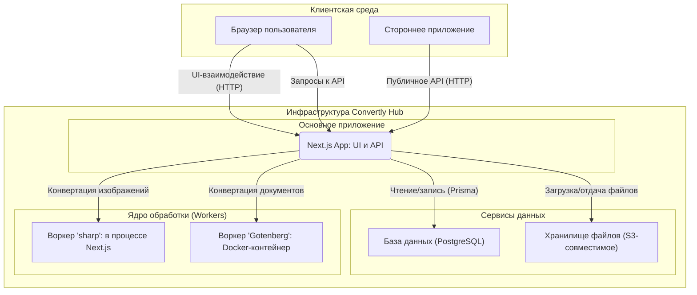

# 🏗️ Архитектура приложения "Convertly Hub"

Этот документ описывает высокоуровневую архитектуру SaaS-платформы "Convertly Hub", разработанную на основе [технического задания](./tech_saas.md). Архитектура спроектирована с учетом принципов масштабируемости, отказоустойчивости и удобства развертывания.

---

## 1. Общая концепция

Система построена на базе фреймворка **Next.js** и следует **трехслойной модели** с четким разделением ответственности (Separation of Concerns).

1.  **Клиентский слой (Frontend):** Пользовательский интерфейс, созданный с помощью React и Tailwind CSS. Отвечает за визуализацию, взаимодействие с пользователем и отображение данных. Рендерится преимущественно на сервере (SSR/RSC) благодаря Next.js.
2.  **Серверный слой (Backend/API):** Бизнес-логика, реализованная на базе API-маршрутов Next.js. Этот слой управляет аутентификацией, доступом к данным, валидацией и выступает в роли оркестратора, координируя работу с базой данных и ядром обработки.
3.  **Ядро обработки (Core/Workers):** Изолированная среда для выполнения ресурсоемких задач по конвертации файлов. Этот слой вынесен за пределы основного серверного процесса, чтобы избежать блокировки Event Loop.

### Схема взаимодействия компонентов



---

## 2. Локальная среда разработки (Docker)

Для обеспечения консистентности и простоты настройки локального окружения используется **Docker Compose**. Файл `docker-compose.yml` определяет и запускает все необходимые сервисы.

```yaml
services:
  db:
    image: postgres:15-alpine
    # ... (база данных PostgreSQL)

  minio:
    image: minio/minio
    # ... (S3-совместимое хранилище)

  gotenberg:
    image: gotenberg/gotenberg:8
    # ... (воркер для конвертации документов)
```

- **`db` (PostgreSQL):** База данных для хранения информации о пользователях, файлах и истории операций.
- **`minio` (MinIO):** S3-совместимое хранилище для загружаемых файлов. Предоставляет веб-интерфейс для удобного просмотра.
- **`gotenberg`:** Воркер для выполнения "тяжелых" конвертаций (например, DOCX в PDF).

Основное **Next.js приложение** запускается **локально на хост-машине** (через `npm run dev`) и подключается к этим сервисам через `localhost` и соответствующие порты, указанные в `docker-compose.yml`.

---

## 3. Структура папок проекта

Проект использует рекомендованную структуру Next.js (App Router), дополненную папками для разделения бизнес-логики.

```plaintext
/
├── 📂 app/                  # Основная папка Next.js App Router
│   ├── 📂 (auth)/           # Группа маршрутов для аутентификации (login, register)
│   ├── 📂 (dashboard)/      # Группа защищенных маршрутов (личный кабинет)
│   ├── 📂 api/              # API-маршруты
│   └── page.tsx             # Главная страница
│
├── 📂 components/           # Переиспользуемые React-компоненты (UI)
│   ├── 📂 auth/             # Компоненты, связанные с аутентификацией
│   ├── 📂 core/             # Ключевые компоненты (Header, Footer, FileDropzone)
│   └── 📂 dashboard/        # Компоненты для личного кабинета
│
├── 📂 lib/                  # Вспомогательные модули (например, клиенты к БД)
│
├── 📂 core/                 # (Планируется) Логика ядра обработки файлов
│
├── 📂 prisma/               # Файлы Prisma ORM (схема, миграции)
│
├── 📂 public/               # Статические файлы (изображения, иконки)
│
├── .env.local               # Переменные окружения (ключи, доступы)
├── .prettierrc              # Конфигурация Prettier
├── .prettierignore          # Файлы, игнорируемые Prettier
├── docker-compose.yml       # Конфигурация локальной среды
├── eslint.config.mjs        # Конфигурация ESLint
├── tailwind.config.ts       # Конфигурация Tailwind CSS
├── postcss.config.mjs       # Конфигурация PostCSS
├── docker-compose.yml       # Конфигурация локальной среды
├── next.config.ts           # Конфигурация Next.js
└── package.json             # Зависимости и скрипты
```

> **Примечание:** Структура отражает целевую архитектуру. Некоторые каталоги, такие как `core`, на данный момент могут быть не реализованы.

---

## 4. Взаимодействие между частями

- **Frontend ↔ Backend:** Клиентская часть (React-компоненты) взаимодействует с серверным слоем через Server Actions и API-вызовы к маршрутам в `/app/api`. Аутентификация управляется библиотекой **NextAuth.js**.

- **Backend ↔ База данных:** Весь доступ к PostgreSQL осуществляется через **Prisma ORM**. Клиент Prisma используется во всех API-маршрутах для CRUD-операций.

- **Backend ↔ Хранилище S3:** Для работы с файлами используется S3-совместимое хранилище. Для локальной разработки — **MinIO**, для продакшена — любой облачный провайдер.

- **Backend ↔ Ядро (Workers):**
  - Легкие задачи (конвертация изображений) выполняются в основном процессе Next.js с помощью библиотеки `sharp`.
  - Тяжелые задачи (конвертация документов) делегируются воркеру **Gotenberg**, работающему в отдельном Docker-контейнере.

---

## 5. Развертывание (Deployment)

Архитектура позволяет гибко подходить к развертыванию.

- **Основное приложение (Next.js):** Разворачивается на платформах вроде **Vercel**, Netlify или в Docker-контейнере на собственном сервере.
- **База данных (PostgreSQL):** В продакшене используется управляемый сервис (`Managed Database`), такой как **Supabase**, **Neon** или **AWS RDS**. Это заменяет локальный Docker-сервис `db`.
- **Хранилище файлов (S3):** Используется облачный сервис, например, **Cloudflare R2** или **AWS S3**. Это заменяет локальный Docker-сервис `minio`.
- **Воркер (Gotenberg):** Разворачивается как отдельный **Docker-контейнер** на любой платформе, поддерживающей их (например, AWS Fargate, Google Cloud Run, или на том же сервере, что и Next.js-приложение).

Такое разделение позволяет масштабировать каждый компонент независимо. Например, при высокой нагрузке можно увеличить количество контейнеров `Gotenberg`, не затрагивая основное приложение.
