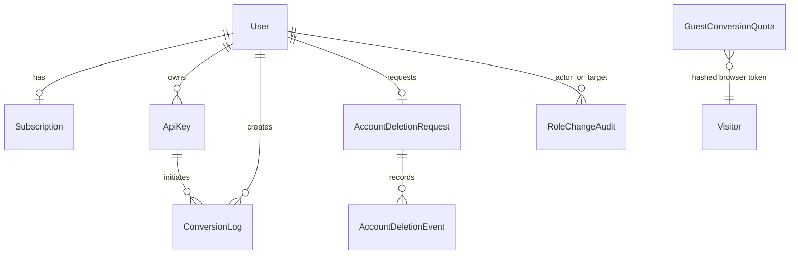

# Database: Prisma, PostgreSQL і узгодженість даних

## 1. Джерело істини та доступ до бази

[`prisma/schema.prisma`](../../prisma/schema.prisma) — єдине джерело
структури даних. Зміна schema сама по собі не змінює PostgreSQL: для неї
створюється нова папка `prisma/migrations/<timestamp>_<name>/migration.sql`, яка
послідовно застосовується `npx prisma migrate deploy`.

[`lib/prisma.ts`](../../lib/prisma.ts) створює `pg.Pool`, передає його
`PrismaPg` adapter і кешує `PrismaClient` у `globalThis` поза production. Це
уникає зайвих з'єднань під час hot reload Next.js:

```ts
const pool = new Pool({ connectionString: process.env.DATABASE_URL });
const adapter = new PrismaPg(pool);
return new PrismaClient({ adapter });
```

`DATABASE_URL` — суворо server-only secret. Prisma Studio зручний для діагностики,
але не замінює migration і прикладну перевірку прав.

## 2. Карта моделей



| Модель                   | Призначення                                  | Важливі поля                                                                                                        |
| ------------------------ | -------------------------------------------- | ------------------------------------------------------------------------------------------------------------------- |
| `User`                   | аккаунт и security state                     | `email`, bcrypt `password`, `role`, `status`, pending/verification/reset/Telegram fields, unique `telegramUsername` |
| `Subscription`           | джерело тарифу для billing                   | `activePlan`, `requestedPlan`, `status`; рівно одна на user                                                         |
| `ApiKey`                 | metadata API credential                      | `keyHash`, `keyPrefix`, `revokedAt`, `userId`                                                                       |
| `ConversionLog`          | життєвий цикл однієї account/API конвертації | source/result metadata, `status`, private `storageKey`, expiry, quota reservation                                   |
| `GuestConversionQuota`   | місячна guest quota                          | `visitorHash`, `periodStart`, image/document counters                                                               |
| `AccountDeletionRequest` | request на контрольоване видалення           | `status`, snapshot `userEmail`, `requestedAt`, `processedAt`, nullable `userId` після видалення                     |
| `AccountDeletionEvent`   | незмінний audit trail видалення              | `type`, `actorEmail`, `createdAt`, `requestId`                                                                      |
| `RoleChangeAudit`        | аудит надання/зміни ролі                     | actor, target, previous/new role                                                                                    |

Файли в PostgreSQL не зберігаються: `ConversionLog` містить metadata, а результат —
у private S3/MinIO object, на який посилається `storageKey`.

## 3. `User` і security state

У `User.email` є unique constraint; під час зміни адреси нова адреса спочатку
потрапляє до `pendingEmail`. Старий підтверджений email лишається робочим до переходу
за one-time link. Тому не можна просто замінити `email` з браузерної форми.

Чутливі поля не видаються API:

```text
password
emailVerificationTokenHash / passwordResetTokenHash
telegramVerificationTokenHash
ApiKey.keyHash
```

Їхні значення є хешами; вихідні email/reset tokens і API secret неможливо
прочитати з Prisma Studio. `UserStatus.SUSPENDED` застосовується в auth helpers,
щоб заблокований користувач не продовжував роботу з раніше створеною сесією.
`telegramUsername` нормалізується за підтвердженої webhook-прив'язки й слугує
лише lookup для Password Reset; доказ володіння лишається у
`telegramId` і `telegramVerified`. Початок нової pending-прив'язки змінює лише
hash/TTL token, тому не позбавляє користувача раніше підтвердженого recovery
channel. Owner-scoped unlink очищує всі Telegram і pending-token поля однією
мутацією.

## 4. Тарифи: єдине джерело істини

`Subscription.activePlan` — єдиний активний тариф. Кожна реєстрація
створює subscription `FREE`; migration
`20260907140000_subscription_plan_source_of_truth` створює їх для legacy-користувачів
і видаляє `User.plan`. Server-код не використовує fallback до користувача.

`requestedPlan` і `PENDING_DEMO` відображають вибраний у mock checkout тариф, який
ще не став оплаченою підпискою. Для ручної demo-зміни використовуйте обмежений
one-off `scripts/sync-user-plan.mjs`, а не Prisma Studio. Він змінює одну
subscription у короткій transaction. Повний production-порядок і audit описано в
[subscription-plan-migration.md](../subscription-plan-migration.md).

Free примусово використовує `storeConversions: true`; non-Free може змінювати
privacy preference. Планові ліміти лежать не в базі, а в
[`lib/billing/plans.ts`](../../lib/billing/plans.ts), тому одне джерело
визначає розмір файлу, API access, conversion/storage quota і retention.

## 5. `ConversionLog`: state machine і storage quota

Допустимий життєвий цикл:

```text
PENDING → PROCESSING → COMPLETED
                     └→ FAILED
```

`processConversionJob` переводить запис із `PENDING` у `PROCESSING` через
`updateMany(... status: 'PENDING')`. Це compare-and-set захист від подвійного запуску.
За успішного stored result заповнюються `resultFileName`, `resultMimeType`,
`resultSize`, `storageKey`, `completedAt`, `expiresAt`.

`storageReservationBytes` тимчасово резервує очікуваний розмір, доки job у
`PROCESSING`. `reserveStorageCapacity()` виконує serialised calculation:

```ts
await prisma.$transaction(async (transaction) => {
  await lockUserQuota(transaction, userId);
  // active stored bytes + processing reservations + new result <= plan quota
  // потім саме ця job отримує storageReservationBytes
});
```

Без reservation два паралельні файли могли б одночасно побачити вільне
місце та перевищити ліміт. Під час completion/failed reservation очищується.

Ідентичний уже доступний результат шукається за індексом:

```prisma
@@index([userId, sourceFileHash, targetFormat])
```

Його використовує browser route для reuse без нової витрати квоти. У API повторне
використання навмисно не ввімкнено так само: його контракт має бути
передбачуваним для інтегратора.

## 6. Індекси та реальні запити

| Індекс                                                      | Для чого                              |
| ----------------------------------------------------------- | ------------------------------------- |
| `User @@index([status])`                                    | швидко відфільтрувати active/suspended |
| `ConversionLog @@index([userId, createdAt])`                | Dashboard history за billing month    |
| `ConversionLog @@index([userId, expiresAt])`                | availability і cleanup/retention      |
| `ConversionLog @@index([status, createdAt])`                | моніторинг completed/failed за період |
| `ApiKey @@index([userId, revokedAt])`                       | список активних ключів користувача    |
| `GuestConversionQuota @@unique([visitorHash, periodStart])` | один лічильник на visitor/місяць      |
| `RoleChangeAudit` indexes                                   | хронологія ролі за target/actor       |

Пошук адмінів за підрядком імені/email у великій БД потребуватиме окремого рішення
з `pg_trgm` і `EXPLAIN ANALYZE`; передчасно додавати індекс без вимірювань не
варто. Це лишається у work plan.

## 7. Транзакції, locks і safe queries

Транзакція має бути короткою: вона захищає зміну даних, але не має
охоплювати зовнішні HTTP-виклики до Gotenberg, S3, SMTP або Telegram. Наприклад,
quota lock використовує PostgreSQL advisory lock, що існує рівно до кінця
transaction:

```ts
await transaction.$executeRaw`
  SELECT pg_advisory_xact_lock(hashtext(${`convertly:user-quota:${userId}`}))
`;
```

Після lock в одній transaction виконуються quota calculation і claim/reservation.
Сама конвертація та upload відбуваються вже після commit; у разі помилки
`processConversionJob` виконує compensating cleanup. З тієї самої причини deletion
workflow спочатку фіксує `PROCESSING`, а S3 cleanup виконує поза тривалою
transaction.

Для читання завжди вибирайте мінімальний `select` і перевіряйте ownership у query,
а не після видачі об'єкта браузеру. Приклад download route — вибірка за
`{ id: conversionId, userId }`; API-ключ не надає доступу до conversion іншого
користувача. Не використовуйте raw SQL, якщо Prisma виражає запит; виняток
тут — документований advisory lock.

## 8. Міграції та безпечна робота

### Локально

```bash
npx prisma generate
npx prisma migrate deploy
npx prisma studio
```

`local-start.md` описує потрібний Docker PostgreSQL. Для чистого оточення
`migrate deploy` застосовує всі наявні міграції в тому порядку, в якому вони
лежать у репозиторії.

### Нова зміна schema

1. Визначте, чи можна застосувати зміну без втрати даних; для production
   кращою є expand → backfill → switch → contract стратегія.
2. Змініть `schema.prisma` і створіть нову migration. Не редагуйте вже застосований
   `migration.sql`.
3. Перевірте `prisma generate`, migration на чистій БД і relevant Jest/integration.
4. Оновіть [db-schema.md](../db-schema.md) та ці guides у разі зміни моделі.
5. У production виконайте backup, потім контрольований `prisma migrate deploy`.
   Не запускайте destructive reset і не використовуйте Prisma Studio як deployment tool.

Докладні контракти database-коду зазвичай наведено разом із
[backend.md](./backend.md), а повний локальний порядок — у
[local-start.md](../local-start.md).
