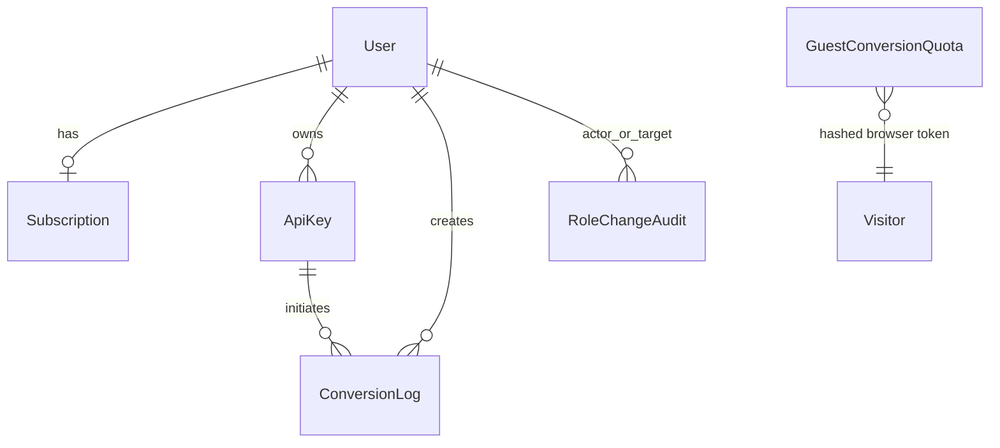

# Database: Prisma, PostgreSQL и согласованность данных

## 1. Источник истины и доступ к базе

[`prisma/schema.prisma`](../../prisma/schema.prisma) — единственный источник
структуры данных. Изменение schema само по себе не меняет PostgreSQL: для него
создаётся новая папка `prisma/migrations/<timestamp>_<name>/migration.sql`, которая
последовательно применяется `npx prisma migrate deploy`.

[`lib/prisma.ts`](../../lib/prisma.ts) создаёт `pg.Pool`, передаёт его
`PrismaPg` adapter и кэширует `PrismaClient` в `globalThis` вне production. Это
избегает лишних соединений при hot reload Next.js:

```ts
const pool = new Pool({ connectionString: process.env.DATABASE_URL });
const adapter = new PrismaPg(pool);
return new PrismaClient({ adapter });
```

`DATABASE_URL` — строго server-only secret. Prisma Studio удобен для диагностики,
но не заменяет migration и прикладную проверку прав.

## 2. Карта моделей



| Модель                 | Смысл                                        | Важные поля                                                                                                         |
| ---------------------- | -------------------------------------------- | ------------------------------------------------------------------------------------------------------------------- |
| `User`                 | аккаунт и security state                     | `email`, bcrypt `password`, `role`, `status`, pending/verification/reset/Telegram fields, unique `telegramUsername` |
| `Subscription`         | тарифный источник для billing                | `activePlan`, `requestedPlan`, `status`; ровно одна на user                                                         |
| `ApiKey`               | metadata API credential                      | `keyHash`, `keyPrefix`, `revokedAt`, `userId`                                                                       |
| `ConversionLog`        | жизненный цикл одной account/API конвертации | source/result metadata, `status`, private `storageKey`, expiry, quota reservation                                   |
| `GuestConversionQuota` | месячная guest quota                         | `visitorHash`, `periodStart`, image/document counters                                                               |
| `RoleChangeAudit`      | аудит выдачи/смены роли                      | actor, target, previous/new role                                                                                    |

Файлы в PostgreSQL не хранятся: `ConversionLog` содержит metadata, а результат —
в private S3/MinIO object, на который ссылается `storageKey`.

## 3. `User` и security state

У `User.email` есть unique constraint; при изменении адреса новый адрес сначала
попадает в `pendingEmail`. Старый подтверждённый email остаётся рабочим до перехода
по one-time link. Поэтому нельзя просто заменить `email` из браузерной формы.

Чувствительные поля не выдаются API:

```text
password
emailVerificationTokenHash / passwordResetTokenHash
telegramVerificationTokenHash
ApiKey.keyHash
```

Их значения являются хешами; исходные email/reset tokens и API secret невозможно
прочитать из Prisma Studio. `UserStatus.SUSPENDED` применяется в auth helpers,
чтобы заблокированный пользователь не продолжал работу с ранее созданной сессией.
`telegramUsername` нормализуется при подтверждённой webhook-привязке и служит
только lookup для Password Reset; доказательство владения остаётся в
`telegramId` и `telegramVerified`.

## 4. Тарифы: единственный источник истины

`Subscription.activePlan` — единственный активный тариф. Каждая регистрация
создаёт subscription `FREE`; migration
`20260907140000_subscription_plan_source_of_truth` создаёт их для legacy-пользователей
и удаляет `User.plan`. Server-код не использует fallback к пользователю.

`requestedPlan` и `PENDING_DEMO` отражают выбранный в mock checkout тариф, который
ещё не стал оплаченной подпиской. Для ручной demo-смены используйте ограниченный
one-off `scripts/sync-user-plan.mjs`, а не Prisma Studio. Он меняет одну
subscription в короткой transaction. Полный production-порядок и audit описаны в
[subscription-plan-migration.md](../subscription-plan-migration.md).

Free принудительно использует `storeConversions: true`; non-Free может изменять
privacy preference. Плановые лимиты лежат не в базе, а в
[`lib/billing/plans.ts`](../../lib/billing/plans.ts), поэтому один источник
определяет размер файла, API access, conversion/storage quota и retention.

## 5. `ConversionLog`: state machine и storage quota

Допустимый жизненный цикл:

```text
PENDING → PROCESSING → COMPLETED
                     └→ FAILED
```

`processConversionJob` переводит запись из `PENDING` в `PROCESSING` через
`updateMany(... status: 'PENDING')`. Это compare-and-set защита от двойного запуска.
При успешном stored result заполняются `resultFileName`, `resultMimeType`,
`resultSize`, `storageKey`, `completedAt`, `expiresAt`.

`storageReservationBytes` временно резервирует ожидаемый размер, пока job в
`PROCESSING`. `reserveStorageCapacity()` выполняет serialised calculation:

```ts
await prisma.$transaction(async (transaction) => {
  await lockUserQuota(transaction, userId);
  // active stored bytes + processing reservations + new result <= plan quota
  // затем именно эта job получает storageReservationBytes
});
```

Без reservation два параллельных файла могли бы одновременно увидеть свободное
место и превысить лимит. При completion/failed reservation очищается.

Идентичный уже доступный результат ищется по индексу:

```prisma
@@index([userId, sourceFileHash, targetFormat])
```

Он используется browser route для reuse без новой траты квоты. У API повторное
использование намеренно не включено тем же способом: его контракт должен быть
предсказуем для интегратора.

## 6. Индексы и реальные запросы

| Индекс                                                      | Для чего                              |
| ----------------------------------------------------------- | ------------------------------------- |
| `User @@index([status])`                                    | быстро отфильтровать active/suspended |
| `ConversionLog @@index([userId, createdAt])`                | Dashboard history за billing month    |
| `ConversionLog @@index([userId, expiresAt])`                | availability и cleanup/retention      |
| `ConversionLog @@index([status, createdAt])`                | мониторинг completed/failed за период |
| `ApiKey @@index([userId, revokedAt])`                       | список активных ключей пользователя   |
| `GuestConversionQuota @@unique([visitorHash, periodStart])` | один счётчик на visitor/месяц         |
| `RoleChangeAudit` indexes                                   | хронология роли по target/actor       |

Поиск админов по подстроке имени/email на большой БД потребует отдельного решения
с `pg_trgm` и `EXPLAIN ANALYZE`; преждевременно добавлять индекс без измерений не
нужно. Это остаётся в work plan.

## 7. Миграции и безопасная работа

### Локально

```bash
npx prisma generate
npx prisma migrate deploy
npx prisma studio
```

`local-start.md` описывает требуемый Docker PostgreSQL. Для чистого окружения
`migrate deploy` применяет все существующие миграции в том порядке, в котором они
лежат в репозитории.

### Новое изменение schema

1. Определите, можно ли применить изменение без потери данных; для production
   предпочтительна expand → backfill → switch → contract стратегия.
2. Измените `schema.prisma` и создайте новую migration. Не правьте уже применённый
   `migration.sql`.
3. Проверьте `prisma generate`, migration на чистой БД и relevant Jest/integration.
4. Обновите [db-schema.md](../db-schema.md) и эти guides при изменении модели.
5. В production выполните backup, затем контролируемый `prisma migrate deploy`.
   Не запускайте destructive reset и не используйте Prisma Studio как deployment tool.

Подробные контракты database-кода обычно идут вместе с
[backend.md](./backend.md), а полный локальный порядок —
[local-start.md](../local-start.md).
