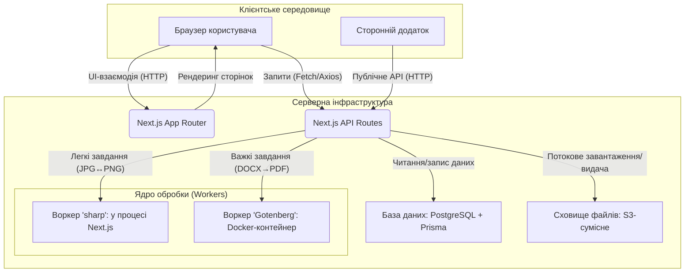

# 🏗️ Архітектура застосунку «Convertly Hub»

Цей документ описує високорівневу архітектуру SaaS-платформи «Convertly Hub», розроблену на основі [технічного завдання](./tech_saas.md). Архітектуру спроєктовано з урахуванням принципів масштабованості, відмовостійкості та зручності розгортання.

---

## 1. Загальна концепція

Систему побудовано на базі фреймворку **Next.js**; вона дотримується **тришарової моделі** з чітким розподілом відповідальності (Separation of Concerns).

1.  **Клієнтський шар (Frontend):** Користувацький інтерфейс, створений за допомогою React і Tailwind CSS. Відповідає за візуалізацію, взаємодію з користувачем і відображення даних. Рендериться переважно на сервері (SSR/RSC) завдяки Next.js.
2.  **Серверний шар (Backend/API):** Бізнес-логіка, реалізована на базі API-маршрутів Next.js. Цей шар керує автентифікацією, доступом до даних, валідацією та виступає в ролі оркестратора, координуючи роботу з базою даних і ядром обробки.
3.  **Ядро обробки (Core/Workers):** Ізольоване середовище для виконання ресурсомістких завдань конвертації файлів. Цей шар винесено за межі основного серверного процесу, щоб уникнути блокування Event Loop.

### Схема взаємодії компонентів



---

## 2. Структура папок проєкту

Проєкт використовує рекомендовану структуру Next.js (App Router), доповнену папками для розділення бізнес-логіки.

```plaintext
/
├── 📂 app/                  # Основна папка Next.js App Router
│   ├── 📂 (auth)/           # Група маршрутів для автентифікації
│   │   ├── 📂 login/
│   │   └── 📂 register/
│   ├── 📂 (dashboard)/      # Група захищених маршрутів особистого кабінету
│   │   ├── 📂 dashboard/
│   │   └── 📂 docs/
│   ├── 📂 api/              # API-маршрути
│   │   ├── 📂 auth/          # Логіка NextAuth.js
│   │   └── 📂 v1/
│   │       └── 📂 convert/  # Головний ендпойнт /api/v1/convert
│   ├── layout.tsx         # Кореневий макет
│   └── page.tsx           # Головна сторінка (/)
│
├── 📂 components/           # Компоненти React для повторного використання (UI)
│   ├── 📂 auth/
│   ├── 📂 core/             # Базові компоненти (кнопки, поля введення)
│   └── 📂 dashboard/
│
├── 📂 lib/                  # Допоміжні модулі та бізнес-логіка
│   ├── db.ts              # Ініціалізація Prisma Client
│   ├── auth.ts            # Конфігурація NextAuth.js та права доступу
│   ├── s3.ts              # Логіка роботи зі сховищем S3
│   └── utils.ts           # Загальні хелпери
│
├── 📂 core/                 # Логіка ядра обробки файлів
│   ├── image-converter.ts # Обробка зображень (sharp)
│   └── document-converter.ts# Взаємодія з воркером Gotenberg
│
├── 📂 prisma/               # Файли Prisma ORM
│   ├── schema.prisma      # Схема бази даних
│   └── 📂 migrations/     # Згенеровані міграції
│
├── 📂 public/               # Статичні файли (зображення, іконки)
│
├── 📂 styles/               # Глобальні стилі
│   └── globals.css
│
├── .env.local               # Змінні середовища (ключі, доступи)
├── next.config.mjs          # Конфігурація Next.js
└── package.json             # Залежності та скрипти
```

---

## 3. Взаємодія між частинами

- **Frontend ↔ Backend:** Клієнтська частина (React-компоненти) взаємодіє із серверним шаром через Server Actions (для форм) і прямі API-виклики до маршрутів у `/app/api`. Автентифікацією сесії користувача керує бібліотека **NextAuth.js** через захищені `HttpOnly` cookie.

- **Backend ↔ База даних:** Увесь доступ до PostgreSQL здійснюється через **Prisma ORM**. `Prisma Client` ініціалізується в `lib/db.ts` і використовується в усіх API-маршрутах для CRUD-операцій із користувачами, API-ключами та історією конвертацій.

- **Backend ↔ Сховище S3:** Для завантаження й завантаження файлів бекенд взаємодіє із S3-сумісним сховищем. Він генерує тимчасові підписані URL (presigned URLs) для безпечного прямого завантаження файлів із клієнта до S3, мінімізуючи навантаження на сервер.

- **Backend ↔ Ядро (Workers):**
  - Під час конвертації зображень API-маршрут безпосередньо викликає функцію з `core/image-converter.ts`, яка використовує бібліотеку `sharp`.
  - Під час конвертації документів API-маршрут надсилає файл мережею (внутрішній HTTP-запит) на адресу Docker-контейнера, де запущено **Gotenberg**. Після обробки він отримує результат і повертає його клієнтові.

---

## 4. Розгортання (Deployment)

Запропонована архітектура спрощує процес розгортання та масштабування.

- **Основний застосунок (Next.js):** Може бути розгорнутий як єдиний застосунок на платформах на кшталт **Vercel** (рекомендовано), Netlify або на власному сервері з Node.js (наприклад, у Docker-контейнері).
- **База даних (PostgreSQL):** Рекомендовано використовувати керований сервіс, такий як **Supabase**, **Neon**, **Railway** або **AWS RDS**, щоб делегувати завдання резервного копіювання та масштабування.
- **Сховище файлів (S3):** Використовується зовнішній сервіс. Для старту ідеально підходить **Cloudflare R2** через відсутність плати за трафік.
- **Воркер (Gotenberg):** Розгортається як окремий **Docker-контейнер**. Його можна запустити на тому самому сервері, що й Next.js-застосунок (для простоти), або на окремій віртуальній машині для незалежного масштабування.

Такий розподіл дає змогу масштабувати кожен компонент незалежно. Наприклад, якщо конвертація документів створює високе навантаження, можна збільшити кількість контейнерів `Gotenberg`, не зачіпаючи основний застосунок.
