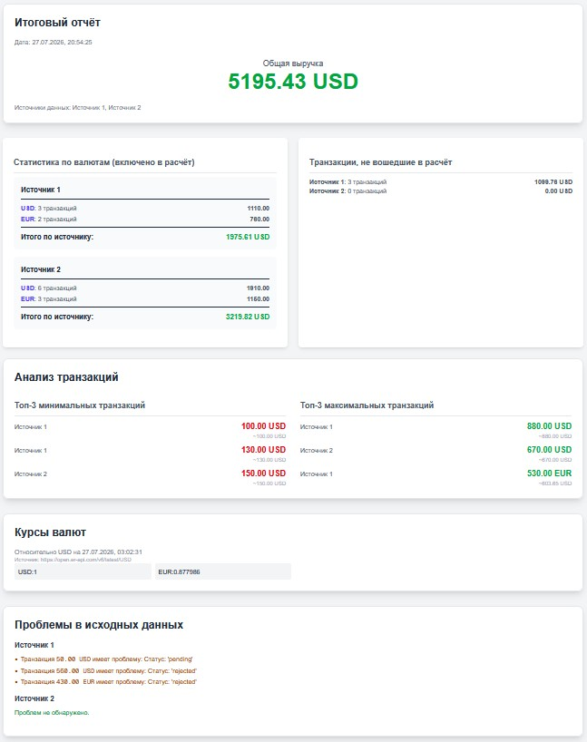

# Gemini 3.1 Pro через https://gemini.google.com / Gemini 2.5 Pro через Gemini Code Assist в VS Code

## Prompt - Часть 1 - Gemini 3.1 Pro через https://gemini.google.com/

### Prompt 1

Проанализируй, какой из основных Frontend инструментов подошел бы для этого проекта, с учетом того, что еще понадобится маршрутизация для нескольких дополнительных страниц, метаинформация о странице (для SEO) будет важна и возможно будут графики на основе данных (курсы валют и прочее). Так же важна адаптивность для различных устройств (десктоп, планшет, мобайл) и скорость загрузки страниц

### Prompt 2

А что скажеш про таких кандидатов: просто React, Vue или что-то на базе него, Svelte, SolidJS, Angular, может ещё что-то? Давай немного ещё проработаем.

## Решение - Часть 1 - Gemini 3.1 Pro через https://gemini.google.com/

### Prompt 1 (Тут можно сказать, не очень повезло, т.к. было два ответа - второй был Next.js и SvelteKit и ИИ попросила меня выбрать какой лучше, выбрал первый и потом вторым промтом уточнял)

С учетом твоих новых вводных — особенно **SEO** и **скорости загрузки** — мы выходим за рамки обычного SPA (Single Page Application), которое по умолчанию генерирует Vite. Обычный SPA отдает браузеру пустой `<div>` и грузит контент скриптами, что поисковики (особенно локальные или менее продвинутые, чем Google) очень не любят.

Для таких требований в современной разработке используются **Meta-фреймворки** (фреймворки над фреймворками) с поддержкой SSR (рендеринг на сервере) или SSG (статическая генерация).

Вот два лучших кандидата для твоей задачи:

## 1. Next.js (на базе React) — Индустриальный стандарт

Если ты готов писать интерфейсы на React, это выбор №1. Он закроет все твои потребности из коробки.

- **SEO и Скорость:** Next.js умеет отдавать поисковику готовую HTML-страницу (SSR), а метатеги (`<title>`, `<meta name="description">`) настраиваются элементарно для каждой страницы через встроенный API. Первичная загрузка происходит мгновенно, так как браузер получает готовую разметку.
- **Маршрутизация:** Встроенный App Router (файловая маршрутизация). Создал папку `app/analytics` — у тебя автоматически появился маршрут `/analytics`. Не нужно тянуть сторонние библиотеки.
- **Графики:** Экосистема React огромна. Для финансовых графиков идеально подойдет **Recharts** или **ApexCharts**. Они легковесные, красивые из коробки и отлично работают с React.
- **Адаптивность:** Next.js великолепно интегрируется с **Tailwind CSS**. Адаптивность для мобилок и планшетов будет делаться добавлением классов прямо в разметку (например, `w-full md:w-1/2`).

## 2. Astro — Король контента и скорости (Идеально для текущего кода)

Если ты не хочешь переписывать всю свою ванильную JS-логику на React-компоненты и тебе нужна максимальная производительность.

- **SEO и Скорость:** Astro изначально создавался для сайтов, где важны SEO и скорость (Zero-JS architecture). По умолчанию он генерирует чистый HTML и отдает **0 байт JavaScript** для статики.
- **Изолированная интерактивность (Islands):** Твои функции калькулятора и запросов к API будут работать как часы. А вот график ты можешь сделать "интерактивным островком". Astro позволяет встроить компонент React (с тем же Recharts) или Vue прямо внутрь ванильного HTML.
- **Маршрутизация:** Тоже файловая, как в Next.js. Очень простая и интуитивная.
- **Адаптивность:** Полная поддержка Tailwind CSS или классического SCSS.

---

### Что с текущим Vite проектом?

Vite — это отличный сборщик (и Astro, кстати, работает на базе Vite под капотом). Но голый `vite-project` с ванильным JS не даст тебе SEO без сложных "костылей" (prerendering плагинов), а маршрутизацию придется писать руками через History API, что долго и чревато багами.

### Мой вердикт

1. Если планируешь строить сложный, высокоинтерактивный дашборд с авторизацией, кучей фильтров и состояний — **переходи на Next.js (React)** или **Nuxt 3 (Vue)**, в зависимости от того, какой синтаксис тебе ближе.
2. Если это скорее информационный проект (лендинг + страница с отчетами и графиками) и ты хочешь сохранить свой нативный JS — бери **Astro**. Он невероятно быстрый и закроет вопрос с SEO на 10 из 10.

### Prompt 2

Отличный подход. Как senior, я всегда советую не брать первый попавшийся популярный инструмент, а примерить разные стеки под конкретные бизнес-требования.

Твое главное требование, которое сразу отсекает половину решений, — **SEO (метаинформация)**.

Давай разберем каждого кандидата с этой точки зрения.

## 1. Чистые SPA: React, Vue, SolidJS (без мета-фреймворков)

Если ты собираешь их через Vite (как делал в начале), на выходе получается Single Page Application (SPA).

- **Как это работает:** Сервер отдает пустой `<body><div id="app"></div></body>`. Весь HTML рисуется джаваскриптом уже в браузере клиента.
- **SEO:** Ужасно. Поисковые роботы Google стали умнее и умеют ждать выполнения JS, но это происходит медленно, с низким приоритетом, а другие поисковики (и мессенджеры при шаринге ссылок) просто увидят пустую страницу без мета-тегов.
- **Вердикт:** Чистые React/Vue отличны для закрытых админок (где SEO не нужно), но **категорически не подходят** для публичных страниц с требованиями к индексации. Чтобы появилось SEO, к ним нужно прикручивать SSR (Server-Side Rendering), а это значит — добро пожаловать в Next.js или Nuxt, о которых мы говорили ранее.

## 2. SolidJS (SolidStart)

Solid — это "React на стероидах". У него похожий синтаксис (JSX), но он не использует Virtual DOM, поэтому работает феноменально быстро. Для SEO у них есть свой мета-фреймворк — SolidStart.

- **Плюсы:** Невероятная производительность. Если страница должна рендерить таблицы на десятки тысяч строк в реальном времени, Solid вне конкуренции.
- **Минусы:** Экосистема пока слишком молода. Найти крутую, готовую и отлаженную библиотеку графиков конкретно под Solid (без "танцев с бубном") будет сложно.
- **Вердикт:** Для пет-проекта или хардкорного перфоманса — да. Для стабильного коммерческого продукта с графиками — пока слишком рискованно.

## 3. Svelte (SvelteKit)

Svelte вообще не отправляет сам фреймворк в браузер. Он работает как компилятор, превращая твои компоненты в ванильный, крошечный JS-код. SvelteKit дает встроенный роутинг и отличное SEO из коробки.

- **Плюсы:** Минимальный размер бандла, высочайшая скорость загрузки (одно из твоих главных требований). Писать код на Svelte очень легко — там почти нет лишнего "бойлерплейта".
- **Минусы:** Экосистема графиков (например, LayerCake) хороша, но она значительно меньше, чем у React/Vue.
- **Вердикт:** Очень сильный кандидат. Если тебе важна идеальная скорость загрузки и ты готов потратить чуть больше времени на кастомизацию графиков — SvelteKit будет шикарным выбором.

## 4. Angular

Enterprise-гигант от Google. "Всё включено" прямо из коробки: строгая типизация, роутер, HTTP-клиент (кстати, со встроенными интерцепторами, так что Axios там не нужен).

- **Плюсы:** Железобетонная архитектура. Если проект будут писать 50 человек в течение 10 лет, Angular стерпит всё. Огромный выбор тяжелых библиотек для графиков (Highcharts, ng2-charts).
- **Минусы:** Для SEO нужно настраивать Angular Universal (SSR), что бывает больно. Очень высокий порог входа. Он невероятно тяжелый для небольших дашбордов.
- **Вердикт:** Оверкилл (избыточен). Использовать его для пары страниц с курсами валют — это как нанимать экскаватор, чтобы посадить цветок.

---

## 5. Скрытая угроза: Astro (Моя личная рекомендация)

Раз уж мы смотрим "что-то еще", я обязан упомянуть **Astro**. Это сейчас один из самых мощных трендов во фронтенде для сайтов, где важно SEO и скорость.

Astro использует "Архитектуру Островов" (Islands Architecture). По умолчанию он генерирует **чистый HTML вообще без JavaScript**.
Но фишка в том, что ты можешь использовать в Astro компоненты из _любого_ фреймворка!

Ты можешь сверстать статичные SEO-страницы на чистом HTML/Astro, а сложный интерактивный дашборд с курсом валют написать на React и вставить его так:
`<CurrencyDashboard client:load/>`

**Почему это может быть идеальным стеком:**

- **SEO:** Абсолютный максимум. Быстрее Astro страницы не грузятся.
- **Графики:** Ты можешь взять самую мощную библиотеку из мира React (Recharts) и использовать её только в одном блоке на странице.

## Сводная таблица для принятия решения

| Инструмент           | SEO      | Скорость загрузки | Экосистема графиков | Идеально для...                                     |
| -------------------- | -------- | ----------------- | ------------------- | --------------------------------------------------- |
| **Next.js (React)**  | Отлично  | Хорошо            | Максимальная        | Крупных веб-приложений и дашбордов.                 |
| **Astro + React**    | Идеально | Идеально          | Максимальная        | Контентных сайтов с вкраплением сложных виджетов.   |
| **SvelteKit**        | Отлично  | Отлично           | Средняя             | Тех, кто любит минимализм и максимальный перфоманс. |
| **Чистый React/Vue** | Провал   | Средне            | Максимальная        | Закрытых систем (админки, внутренние порталы).      |
| **Angular**          | Сложно   | Средне            | Большая             | Огромных банковских корпоративных систем.           |

## Prompt - Часть 2 - Gemini 2.5 Pro через Gemini Code Assist в VS Code

### Prompt 1

Контекст - папка next-project и next-project/app/src-vite-project

Ты Frontend разработчик с 10ю годами опыта. В папке next-project развёрнут с нуля проект Next.js, а в папке next-project/app/src-vite-project лежит приложение, использующее нативный JS. Так же в корень проекта перенёс файл .env. Твоя задача - это переписать и интегрировать его в этот Astro проект с учетом правильной архитектуры и подходов данного инструмента. После этого папку src-vite-project можно удалить из проекта. Все изменения делай в папке next-project и подпапках

> И далее пару десятков промптов, что бы допилить)

## Решение - Часть 2 - Gemini 2.5 Pro через Gemini Code Assist в VS Code

### Prompt 1

К сожалению, не с одного промпта вышло и не совсем как в vite-project вёрстка - Section / SubSection и прочие мелочи.

```text
next-project/
├── app/
│   ├── lib/
│   │   ├── api.ts
│   │   ├── adapters.ts
│   │   ├── analyzer.ts
│   │   ├── calculator.js
│   │   └── config.ts
│   ├── favicon.ico
│   ├── globals.css
│   ├── layout.tsx
│   └── page.tsx
├── public/
├── .env
├── next.config.mjs
├── package.json
└── ...

```


