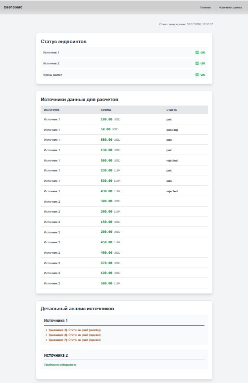

## Skill API Response Audit (для Gemini Code Assist в VS Code)

Вариант ниже не работает для Gemini Code Assist в VS Code. Поэтому сделал так:

1. scripts\audit-api.mjs
2. @GEMINI.md @.gemini\skills\api-response-auditor\SKILL.md проверь ответы API

## Skill API Response Audit (не для Gemini Code Assist в VS Code)

.gemini\skills\api-response-auditor\SKILL.md

---

name: api-response-auditor
description: Автоматизированный аудит ответов финансовых API (Source 1, Source 2 и Rates) на соответствие контрактам, валидность форматов и наличие аномалий в данных.

---

# Цель навыка (Skill Objective)

Выявление потенциальных проблем со стороны сервера в ответах API с финансовыми данными. Навык гарантирует, что данные соответствуют ожидаемым структурам фронтенда до того, как они попадут в бизнес-логику, и формирует отчет для backend-разработчиков для устранения неточностей.

# Триггеры активации (Triggers)

Активируй этот навык, если запрос пользователя содержит:

- "Проверь ответы API" / "Сделай аудит финансовых эндпоинтов"
- "Проверь данные от бэкенда"
- "Сформируй отчет по ошибкам API"
- Либо если при работе с `getUnifiedTransactions` или `analyzeTransactions` возникают ошибки парсинга.

# Инструкции по выполнению (Execution Steps)

Ты ОБЯЗАН выполнить следующие шаги строго по порядку, используя скрипты (Node.js) для выполнения запросов.

## Шаг 1: Подготовка окружения и ключей

1. Загрузи переменную окружения `CPA_API_KEY` (из `.env` или `.env.local`).
2. Сформируй заголовки для запросов к закрытым эндпоинтам: `{"x-api-key": process.env.CPA_API_KEY}`[cite: 5].

## Шаг 2: Выполнение запросов (Data Fetching)

Выполни GET-запросы к следующим эндпоинтам и сохрани сырые ответы:

1. **Источник 1:** `https://cpa-server-vtel.onrender.com/api/finance1` (требует `x-api-key`)[cite: 5].
2. **Источник 2:** `https://cpa-server-vtel.onrender.com/api/finance2` (требует `x-api-key`)[cite: 5].
3. **Курсы валют:** `https://open.er-api.com/v6/latest/USD` (открытый API, без ключа)[cite: 5].

## Шаг 3: Аудит данных (Data Validation)

Проверь полученные данные на соответствие контрактам фронтенда:

**Для Источника 1:**

- Убедись, что ответ содержит массив `transactions`[cite: 1].
- Проверь каждый элемент массива: он должен содержать поля `type`, `amount` (число) и `currency` (строка)[cite: 1].
- Зафиксируй транзакции, где сумма (amount) <= 0[cite: 2].
- Отметь валюты в нижнем регистре (фронтенд ожидает верхний регистр)[cite: 1].
- Зафиксируй статусы `type`, отличные от "paid" (например, "pending", "rejected")[cite: 1].

**Для Источника 2:**

- Убедись, что ответ — это плоский массив[cite: 1].
- Проверь формат каждого элемента: это должна быть строка, разделенная пробелом (например, `"300 usd"`)[cite: 1].
- Зафиксируй любые элементы, которые не являются строками (они помечаются как `"invalid"` на фронтенде)[cite: 1, 2].
- Убедись, что сумма успешно парсится как число (`parseFloat`)[cite: 1].

**Общие проверки по курсам валют:**

- Сопоставь все найденные валюты (из обоих источников) с объектом курсов `rates`, полученным от открытого API[cite: 2, 5].
- Строго зафиксируй любую валюту, для которой нет курса (это вызывает ошибку `Нет курса для ...` на фронтенде)[cite: 2].

## Шаг 4: Формирование отчета

На основе найденных аномалий сгенерируй отчет. Сгруппируй проблемы по источникам и типам ошибок:

- Невалидный формат данных (ожидался другой тип).
- Проблемы с суммами (<= 0 или не парсятся).
- Неизвестные валюты (нет в справочнике `rates`).
- Транзакции в статусе, отличном от "paid" (для Источника 1)[cite: 2].

# Ограничения и правила (Constraints & Rules)

- **Только чтение:** Запрещено выполнять мутирующие запросы.
- **Безопасность ключей:** НИКОГДА не выводи `CPA_API_KEY` в итоговый отчет или логи.
- **Точность данных:** Оперируй оригинальными значениями из API. Фронтенд переводит суммы в центы (`amount * 100`)[cite: 1], но в отчете указывай исходные пришедшие значения.

# Формат вывода (Expected Output)

Предоставь пользователю структурированный отчет.

1. **Именование и сохранение файлов:**
   - Сохрани результаты в файл `docs/audits/api-audit-latest.md` (перезаписывая его при каждом новом аудите).
   - Создай архивную копию с таймстемпом в формате `docs/audits/api-audit-YYYY-MM-DD-HH-MM.md`.
   - Если пользователь в промпте явно запросил PDF, напиши и выполни скрипт для конвертации отчета в формат PDF.
2. **Сводка:** Дата проверки, статус доступности всех трех эндпоинтов.
3. **Источник 1 (finance1):** Список транзакций с ошибками структуры, отрицательными/нулевыми суммами и неизвестными валютами.
4. **Источник 2 (finance2):** Список невалидных строк и неизвестных валют.
5. **Рекомендации:** Технические указания для бэкенда в формате `[Эндпоинт] - [Проблема] -> [Ожидаемое поведение]`.
6. Заверши ответ строго фразой: _"Аудит API завершен. Отчеты сформированы. Жду дальнейших указаний."_

