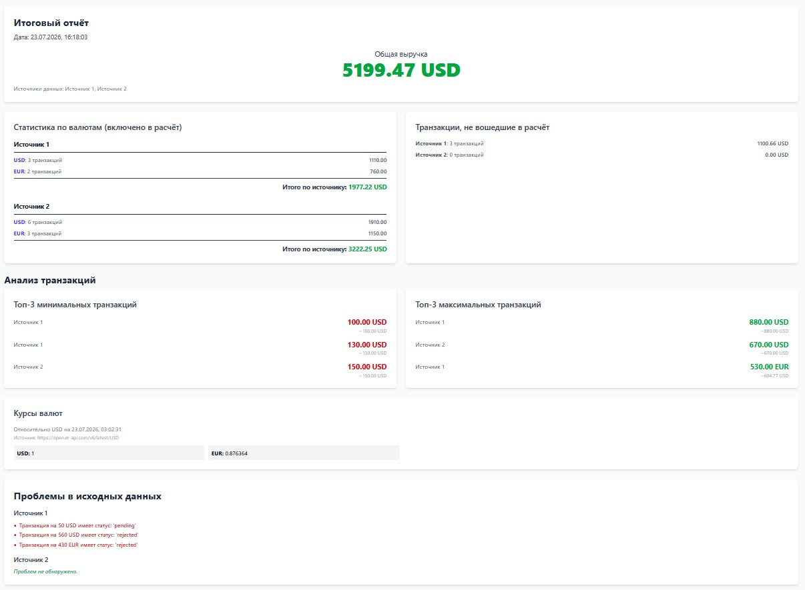

# Gemini 2.5 Pro через Gemini Code Assist в VS Code

## Prompt - основные

> За один промпт не вышло)

### Prompt 1

Указал контекст - папку vite-project

@vite-project

Ты senior fullstack разработчик с 10ю годами опыта. Необходимо результат работы приложения vite-project (расчеты и дату) отобразить в интерфейсе на странице. При этом добавить функции:

1. отобразить общую сумму, целевую валюту (usd) и дату / время отчёта, указать какие источники
2. отобразить статистику по валютам: сколько какой валюты количество записей и сумм по источникам
3. отобразить количество записей и сумм, которые не участвуют в расчётах (не paid) по источникам
4. если возникла проблема в расчетах - отобразить это ошибкой в интерфейсе, т.е. предусмотреть интерфейс ошибки, если что-то пойдет не так
5. так как используем курс валюты, то вывести актуальный курс в интерфейс и дату запроса
   Возможно что-то не учёл, если пропустил что-то критичное на твой взгляд, то добавь так же.
   Используй только нативный JS для рендеринга функционала и tailwind для красивой стилизации приложения. При создании новых файлов соблюдай адекватную структуру проекта

> Потом с десяток промптов ушло на настройку Tailwind. Скорее всего вышло бы проще, если бы посмотрел документацию - https://tailwindcss.com/docs/installation/using-vite

### Prompt 2

Отлично, заработало. Спасибо) Выглядит супер)

Что бы хотел улучшить:

1. Статистика по валютам (включено в расчёт) - давай тут сделаем с розбивкой по источникам. Типа, Источник 1 и перечень валют с суммами. Потом итого по Источник 1 и далее следующий источник. И в конце итого по всем.
2. Курсы валют. Тут только целевая и те валюты, что есть в источниках. И добавить рядом или под "Курсы валют" источник откуда берём курсы.
3. Добавить блок с минимальной и максимальной странзакцией. Перед "Курсы валют". Валюта, сумма, источник или какой-то другой порядок. Или может лучше сделать Топ 3 мин и Топ 3 макс.

> Промта 3 - 4 что бі докрутить функционал

### Prompt 3

О, супер! Всё отлично сделано.

И давай ещё реализуем блок - Проблемы в исходных данных". Тут будем выводить если в данных чего-то не додали, например, валюту или транзакцию или ещё что-то. Давай только по логике решим как лучше. Если всё норм, то в этом блоке сообщение про то что проблем в исходных данных нет. Если что-то не так, то указываем что не так и источник, например, нет валюты и прочее. И разместить этот блок скорее всего лучше в самом низу?

> Промта 3 - 4 что бі докрутить функционал

### Prompt 4 (От Ивана про проблему округления и плавающей точки в финансах)

В каждом домене (финансовый, тревел, юридический и тп) есть свои правила. Как быть с проблемой округления и плавающей точки в финансах?

Сейчас мы до 2 знаков округляэм, курсы 6 знаков после запятой. Как выводить в браузер и как промежуточные расчёты?

### Prompt 5 (Продолжение Prompt 4)

Ранее до рефакторинга у нас было 5199.46, а сейчас стало 5199.47. Я так думаю, что это из-за того, что у нас промежуточные вычисления с 2 знаками после запятой дали такое.

## Решение

### Prompt 4 (От Ивана про проблему округления и плавающей точки в финансах)

Проблема: почему нельзя использовать toFixed(2) и обычные числа для денег
Короткий ответ: компьютеры не умеют точно хранить большинство десятичных дробей.

Внутри JavaScript (как и во многих других языках) число 10.25 хранится не как "десять и двадцать пять", а в двоичном формате с плавающей точкой (стандарт IEEE 754). Этот формат приводит к микроскопическим ошибкам при вычислениях.

Когда мы проводим десятки таких операций, а потом умножаем на курс валют с 6 знаками после запятой, эти ошибки накапливаются и могут привести к потере или появлению лишних центов, что в финансах недопустимо. Метод toFixed() лишь маскирует проблему для вывода, но не решает ее в процессе вычислений.

Решение: работаем с деньгами как с целыми числами
Профессиональный стандарт для работы с деньгами — полностью отказаться от чисел с плавающей точкой для хранения и расчетов. Вместо этого все операции проводятся в наименьших единицах валюты — центах (копейках, и т.д.).

1. Хранение и расчеты: Сумма $19.99 хранится и передается между функциями как целое число 1999.
2. Конвертация на входе: Как только мы получаем данные из внешнего мира (API, база данных), мы немедленно преобразуем их в центы: Math.round(amount \* 100).
3. Конвертация на выходе: Когда нужно показать сумму пользователю в интерфейсе, мы делаем обратное преобразование: (amountInCents / 100).toFixed(2).
   Этот подход гарантирует, что в процессе всех промежуточных вычислений мы работаем с целыми числами, избегая ошибок округления.

Давай внедрим этот надежный паттерн в наш проект.

### Prompt 5 (Продолжение Prompt 4)

Ты абсолютно прав, и это отличный, очень глубокий вопрос. То, что ты заметил эту разницу в 1 цент, показывает, почему наш рефакторинг на работу с центами был таким критически важным.

Твоя догадка верна — всё дело в разном подходе к вычислениям и округлению.

Почему так произошло: Старый vs Новый метод
Старый метод (рискованный, результат ...46)
Раньше мы работали с числами с плавающей точкой. Процесс выглядел так:

Суммировались все транзакции в одной валюте (например, 1910 EUR).
Эта общая сумма конвертировалась в USD, порождая длинную дробь (например, 1910 EUR / 0.923... = 2068.31908... USD).
Эта "длинная" сумма складывалась с другой "длинной" суммой.
Только в самом конце мы применяли toFixed(2), который просто "отрезал" хвост у финального числа.
Проблема в том, что на каждом шаге сложения и деления дробей накапливались микроскопические ошибки (как 0.1 + 0.2 = 0.30000000000000004). В итоге финальное округление могло дать неверный результат.

Новый метод (правильный, результат ...47)
Сейчас мы работаем как кассир в банке — оперируем наименьшей единицей, центом, и используем только целые числа.

1. На входе: Каждая транзакция (amount: 230 EUR) немедленно превращается в целое число центов (amountInCents: 23000).
2. При конвертации: Мы конвертируем центы в центы. Например, 23000 евро-центов делятся на курс (/ 0.923...), и результат немедленно округляется до ближайшего целого цента с помощью Math.round().
3. Все расчеты: Вся дальнейшая математика (сложение, вычитание) — это операции с целыми числами, которые абсолютно точны и не имеют проблем с плавающей точкой.
4. На выходе: Только в самый последний момент, для отображения пользователю, мы делим итоговую сумму в центах на 100.
   Итог
   Разница в 1 цент — это и есть та самая исправленная ошибка. Новый результат 5199.47 является более точным и правильным с точки зрения финансовых систем. Мы перешли от "приблизительной" математики с плавающей точкой к "точной" целочисленной математике в центах, как это и принято в профессиональной разработке.

```text
vite-project/
├── .env
├── index.html
├── package.json
├── postcss.config.js
├── tailwind.config.js
├── src/
│   ├── api.js
│   ├── adapters.js
│   ├── analyzer.js
│   ├── calculator.js
│   ├── config.js
│   ├── main.js
│   ├── style.css
│   └── ui.js
└── ... (другие файлы, например, node_modules)
```


